# Kubernetes - Intro
## Install minikube
1. Download dan jalankan intsaller rilis versi terakhir atu dengan menggunakan command 
pada powershell

    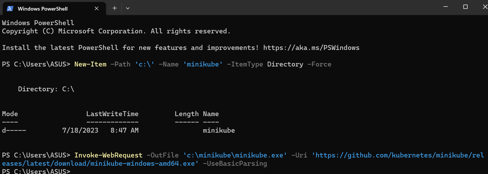

    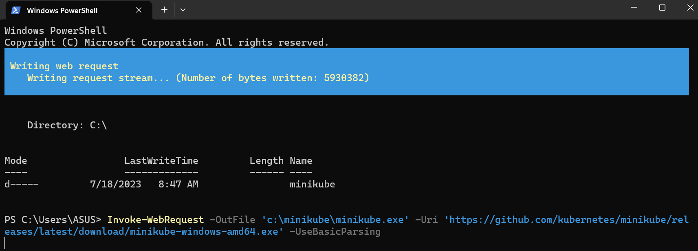

2. Tambahkan minikube.exe pada path, jalankan pada powershell administrator

    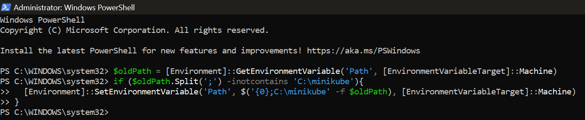

## Membuat Minikube Cluster dengan menjalankan perintah ```minikube start```

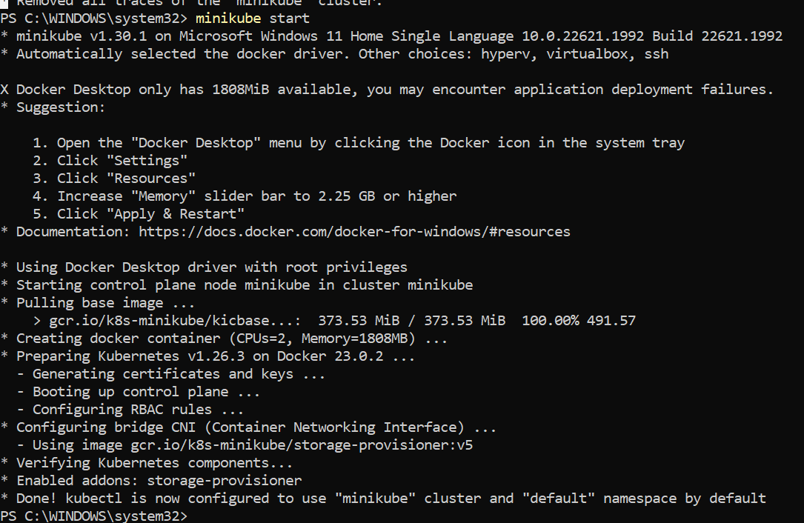

 ## Buka Dashboard

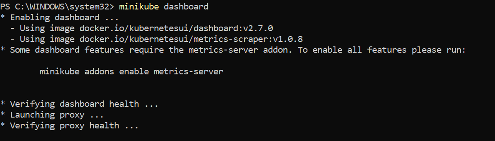

Direct ke web browser

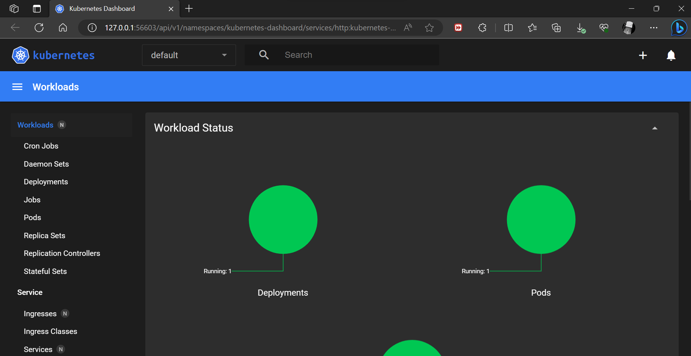

Penjelasan:
Dashboard ini digunakan untuk mengaktifkan add-on dashboard dan membuka proxy di 
browser.

## Create Deployment, gunakan powershell baru dengan tidak menghentikan layanan yang sebelumnya dijalankan
1. Gunakan perintah kubectl create untuk menjalankan create deployment yang 
memanajemen POD. POD menjalankan container berdasarkan Docker image.

    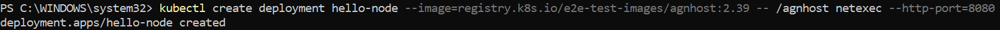

2. Melihat deployment

    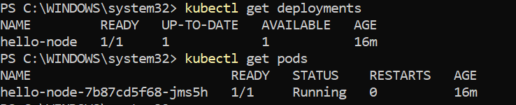
   
3. View the Pod

     
   
4. View cluster event
    
    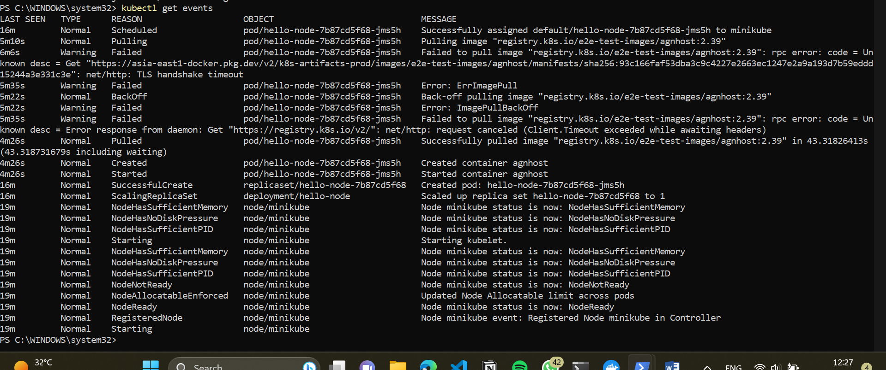

5. View the kubectl configuration

    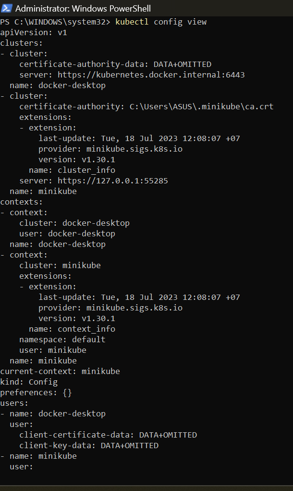
## Membuat Layanan
1. Expose Pod ke internet publik dengan perintah kubectl expose

   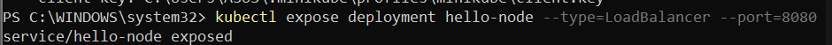
Kode aplikasi di dalam gambar uji hanya mendengarkan pada port TCP 8080. Jika Anda 
biasa mengekspos port yang berbeda, klien tidak dapat terhubung ke por lain
2. View layanan yang dibuat

    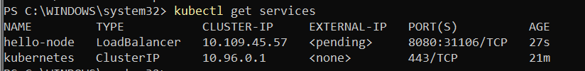
3. Jalankan perintah untuk run service

     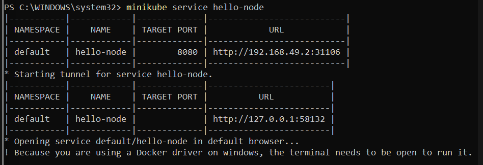

     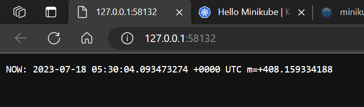
Penjelasan :
Perintah ini akan menjalankan broweser yang menjalankan layanan aplikasi yang 
dibuat.
## Enable addons
1. List addons yang sedang dijalankan

   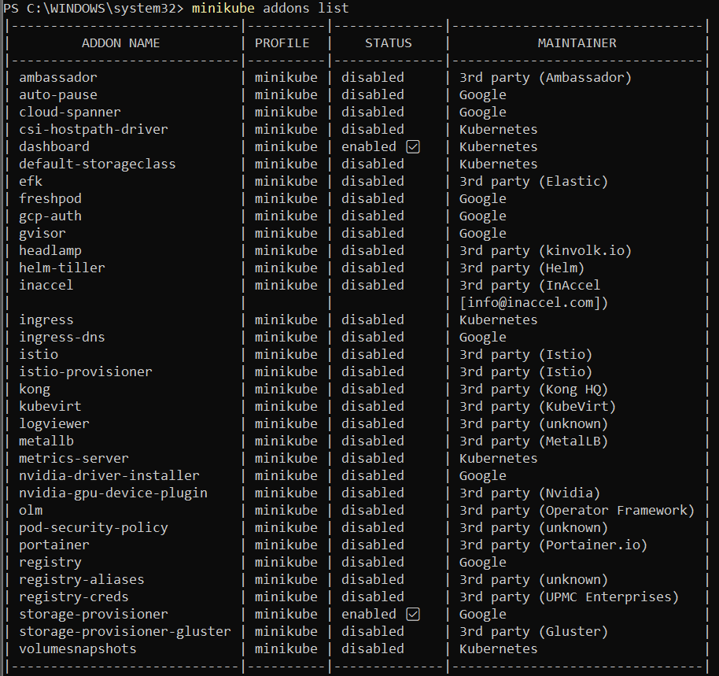
   
2. Enable addon dengan metric-server

    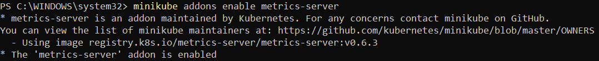
   
5. Lihat Pod dan layanan yang dibuat dengan menginstall addon

     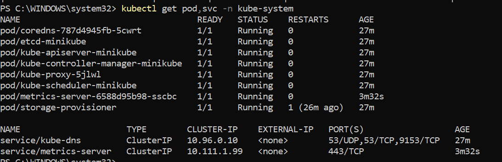

6. Disable matrics-server

     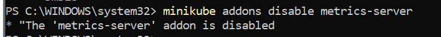

 ## Clean Up
1. Bersihkan sumber yang dibuat dari cluster

   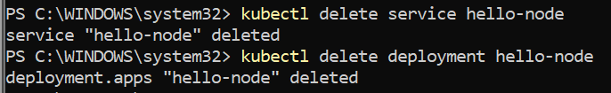
   
2. Stop minikube cluster

   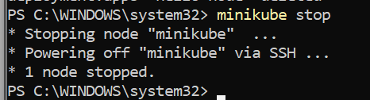
   
3. Hapus minikube VM

   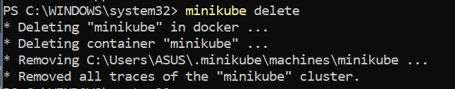
