# Installasi Git Windows

[ [<< Kembali](README.md) ]

1. Double click pada file download Git kemudian klik **Next** untuk melanjutkan installasi.

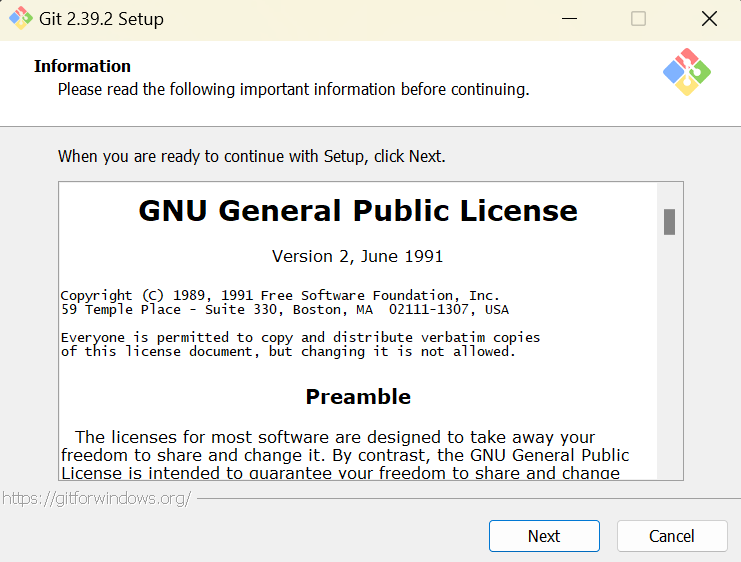

2. Setelah itu pilih lokasi instalasi. Secara default akan terisi _C:\Program Files\Git_. Gantilah lokasi jika menginginkannya.

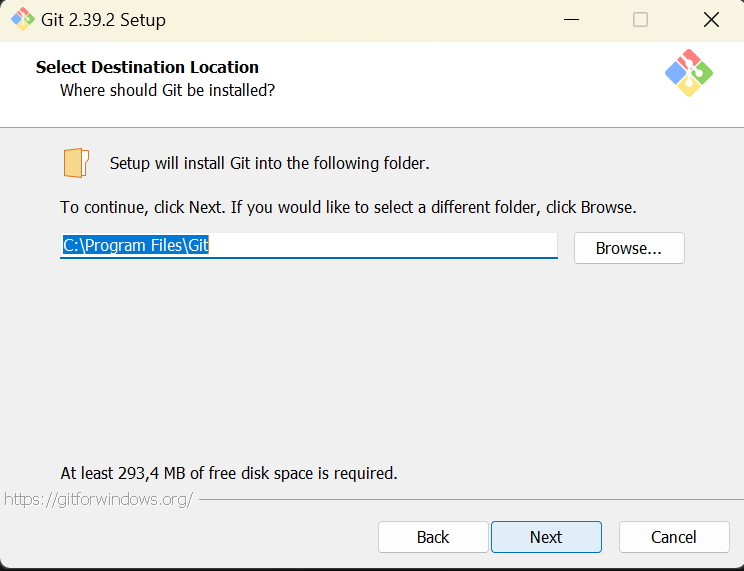

3. Pilih komponen. Tidak perlu diubah-ubah, sesuaikan dengan default saja lalu klik **Next**.

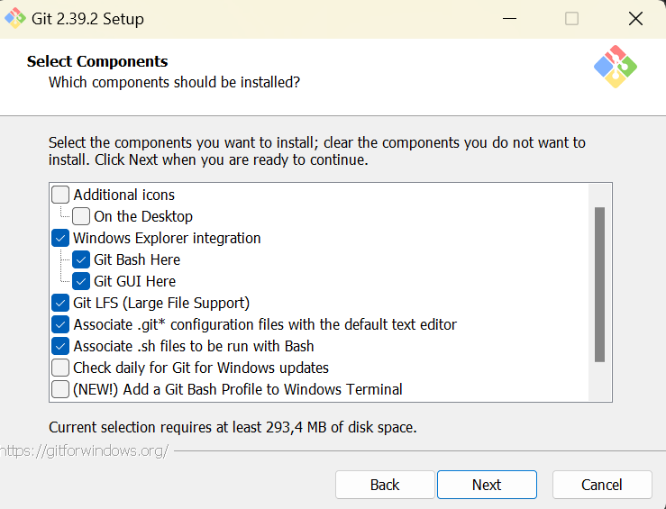

4. Mengisi shortcut untuk menu start. Gunakan default **(Git)**, ganti jika ingin mengganti -misalnya Git VCS

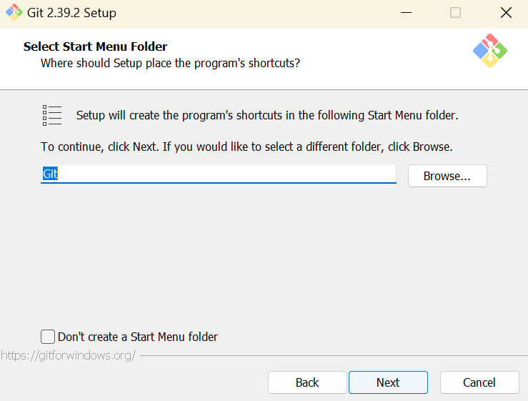

5. Pilih edior yang akan digunakan bersama dengan Git. Pada pilihan ini, digunakan Visual Studio Code.

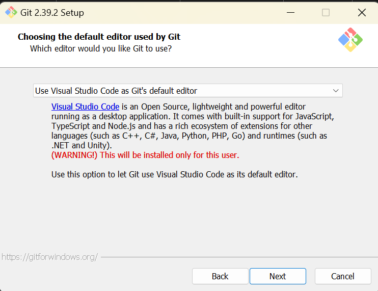

6. Pada saat installasi, Git menyediakan akses git melalui Bash maupun commad prompt. Pilih pilihan kedua supaya bisa menggunakan dua antarmuka.

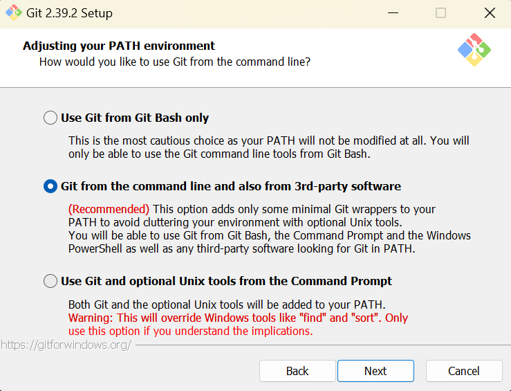

7. Pilih OpenSSL untuk HTTPS. Git menggunakan https untuk akses ke repo GitHub atau repo-repo lain.

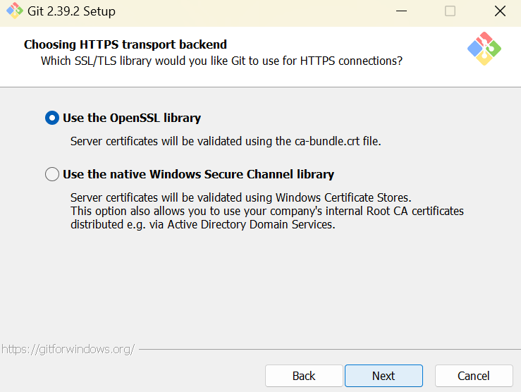

8.Pilih pilihan pertama untuk konversi akhir baris (CR-LF).

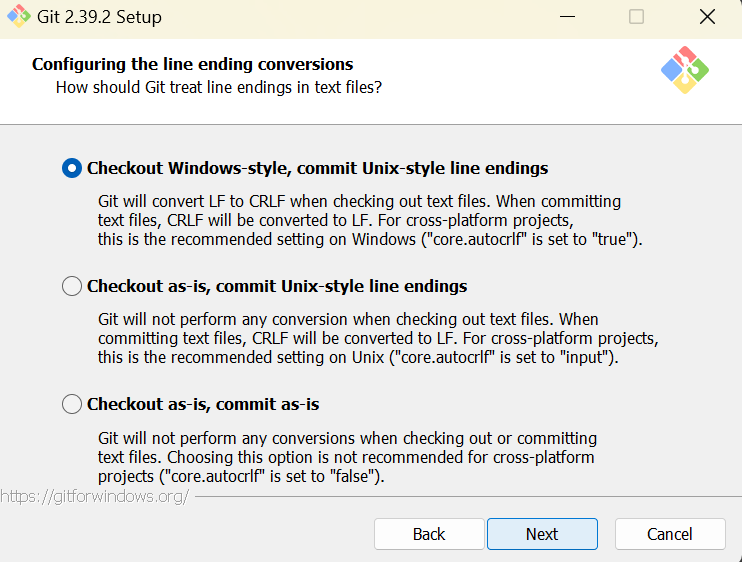

9. Pilih PuTTY untuk terminal yang digunakan untuk mengakses GitBash.

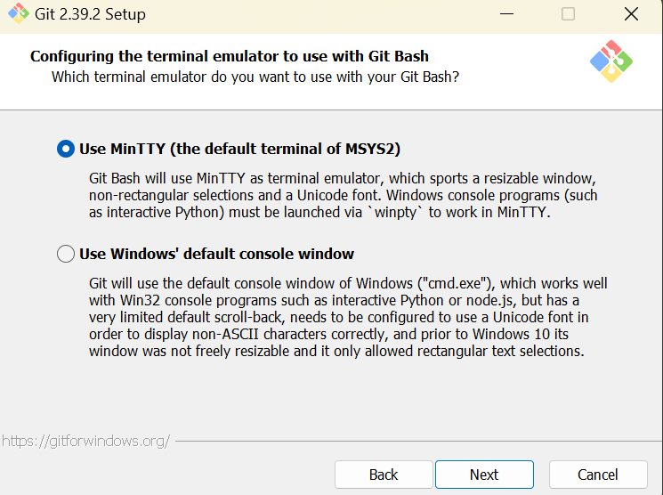

10. Opsi ekstra, pilih enable file system caching.

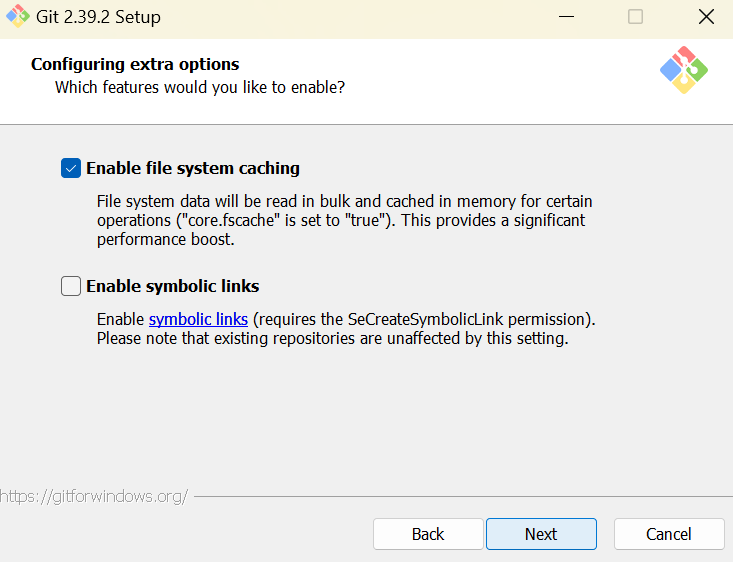

11. Setelah itu proses installasi akan dilakukan.

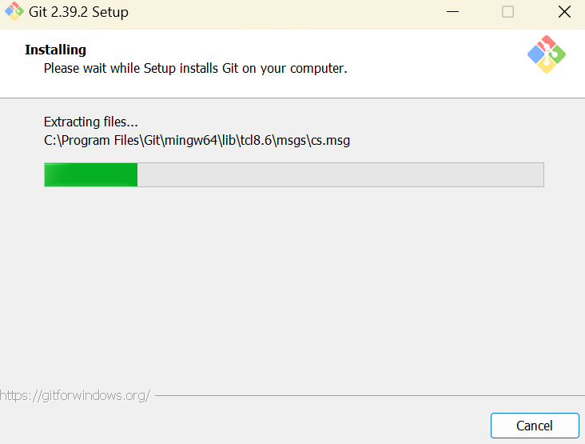

12. Jika sudah selesai akan muncul dialog pemberitahun lalu kilik **Finish**.

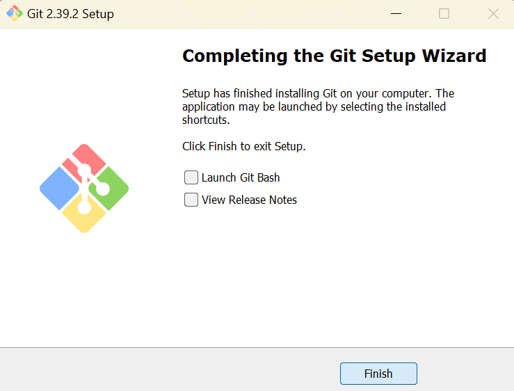

13. Menjalankan Git dari menu start ketikkan "Git", lalu akan muncul pilihan "Git Bash", "Git CMD" atau "Git GUI"

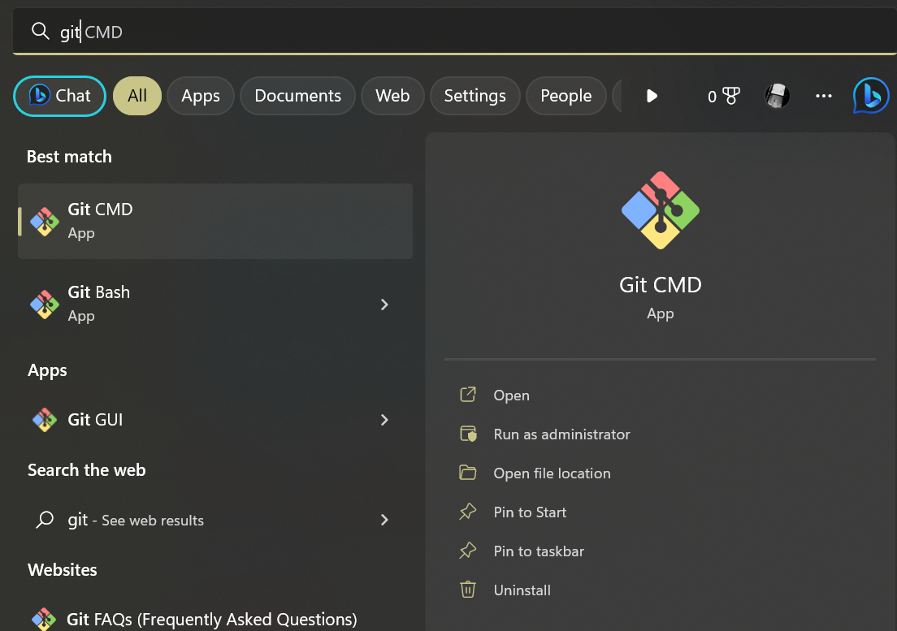

14. Tampilan jika menggunakan "Git Bash"

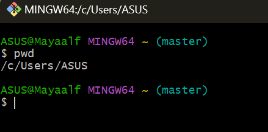

15. Tampilan jika menggunkan "Git GUI"

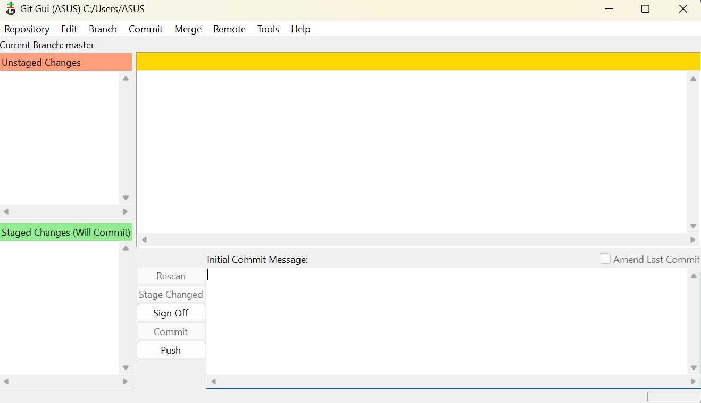

16. Mencoba dari command prompt lalu eksekusi "git --version" untuk melihat sudah berhasil terinstall atau belum. Jika sudah terinstall dengan benar maka akan muncul seperti ini :

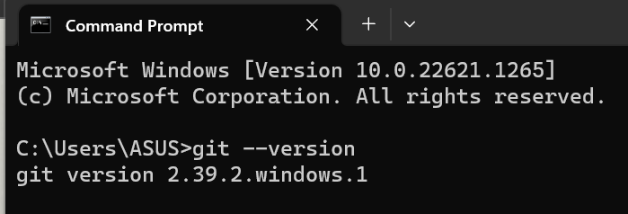


# Konfigurasi Git

Konfigurasi menggunakan username dan email dengan perintah berikut :

```
$ git config --global user.name "Nama Anda di GutHub"
$ git config --global user.email email@domain.tld
```

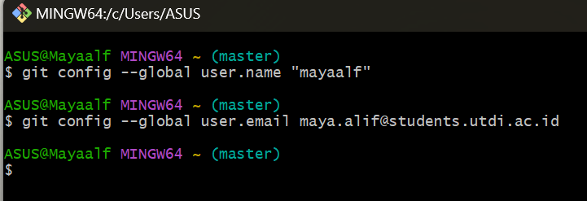

Isian diatas harus sesuai dengan email yang digunakan untuk mendaftar GitHub. Untuk melihat konfigurasi yang sudah ada :

```
$ git config --list
user.name=mayaalf
user.email=maya.alif@students.utdi.ac.id
$
```

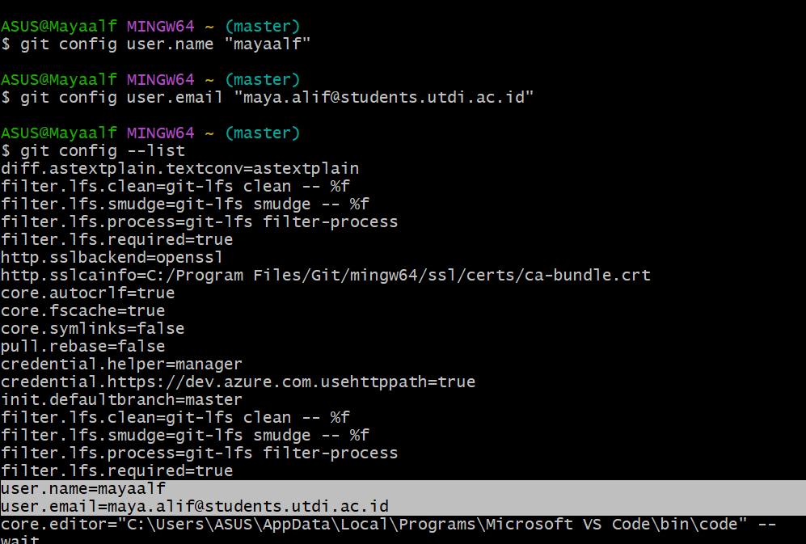

Langkah ini cukup dilakukan sekali saja, kecuali jika ingin melakukan perubahan nama dan email.


# Mengelola Repo Sendiri

## Mengelola Repo Sendiri di Account Sendiri
