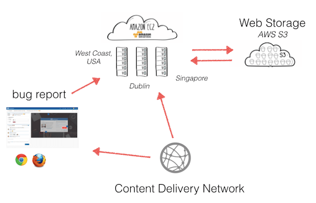

# Rangkuman Materi dan Penjelasan

## What is the differents between IaaS, SaaS and PaaS

- IaaS merupakan suatu model layanan yang terletak pada layer pertama dan paling bawah, suatu organisasi atau perusahaan memegang dan mengelola akses dari cloud resource seperti penyimpanan, jaringan dan server sesuai kebutuhan yang ada dalam organisasi itu sendiri sehingga organisasi tidak mengelola sistem operasi namun tetap mengelola data, platform serta aplikasi. IaaS dikontrol oleh IT administrator.

  Contoh dari IaaS : Linode, Rackspace, Amazon Web Service, Microsoft Azure, Google Compute Engine
- PaaS merupakan suatu model layanan yang terletak setelah layer kedua setelah layer IaaS, memungkinkan suatu organisasi untuk menggunakan layanan yang tersedia seperti layanan kerangka kerja dan resource computing secara lengkap untuk kepentingan development dan deployment aplikasi. PaaS dikontrol oleh software developers.

  Contoh dari PaaS : Heroku, Google App Engine, Red Hat's OpenShift
 - SaaS merupakan suatu model layanan yang terletak pada lapisan ke tiga diatas layer PaaS,memungkinkan suatu organisasi untuk menggunakan layanan sesuai dengan permintaan yang diakses melalui thin client melalui web browser. Semua layanan dari SaaS dikelola oleh vendor dari mulai aplikasi sampai penyimpanan dan jaringan. SaaS dikontrol oleh end-user itu sendiri.
    
    
    Contoh dari SaaS : Gmail, Google Docs, office 365, Paypal, Facebook
    
## SaaS Platform Architecture
  
Aplikasi diinstal pada beberapa mesin untuk mendukung skalabilitas, menawarkan sekelompok pelanggan tertentu dengan akses ke versi pra-rilis untuk pengujian.

### Varietas Utama SaaS

- SaaS Vertikal

  SOftware yang menjawab kebutuhan industri tertentu (ex: perangkat lunak untuk industru perawatan kesehatan, pertanian, keuangan)

- SaaS Horisontal

  Produk yang berfokus pada kategori perangkat lunak (ex: pemasaran, penjualan, alat pengembang dan SDM) tetapi agnostik industri.
  
 ### Manfaat SaaS
 
1. Mengallihkan risiko akuisisi perangkat lunak dan memindah TI dari pusat biaya reaktif menjadi proaktif yang akan menghasilkan nilai dari perusahaan.
2. Aplikasi SaaS tidak memerlukan penyebaran infrastruktur besar di lokasi klien sehingga mengurangi penggunaan sumber daya.
3. Menawarkan *test drive* yang bebas risiko dari perangkat lunak untuk mencobanya sebelum membeli perangkat lunak.

### Dampak dan Peran Tanggung Jawab TI

Menyebabkan perubahan mendasar pada peran departemen TI sebagai penyedia layanan informasi. Dengan SaaS kontrol pusat data tidak selalu dengan kontrol seluruh lingkungan komputasi dalam persahaan.
  
## SaaS (Software as a Service) Platform Architecture

SaaS adalah cara untuk mengirimkan perangkat lunak, penyedia perangkat lunak yang terpusat untuk hoshting satu atau lebih aplikasi untuk pelanggan melalui internet. Model yang termasuk dalam SaaS :
1. Infrastruktur sebagai Layanan
2. Platform sebagai Layanan
3. Pembelajaran Mesin sebagai Layanan

#### Konsumen pada layanan SaaS :
1. Netflix
2. Microsoft Office 365
3. Google Dokumen
4. Twitter

#### Manfaat penerapan arsitektur SaaS dalam bisnis :
1. Mengurangi waktu
2. Biaya perawatan yang rendah
3. Peningkatan Otomatisasi
4. Lebih hemat biaya

#### Fitur Utama dan Manfaat Platfrom SaaS :
1. Kesederhanaan Aplikasi Asitektur SaaS
2. Nilai Ekonomis
3. Keamanan
4. Kompatibilitas

#### Kekurangan Platform SaaS :
1. Kurang kontrol dalam platform, karena SaaS dihosting dalam lingkungan Saas vendor
2. Ekosistem Terbatas 
3. Peforma, karena aplikasi internal akan selalu berjalan lebih cepat daripada produk yang dikirim melalui internet.
4. Masalah Data, karena dalam penyimpanan data cloud memiliki kebijakan dan tindakan legislatif ketika diproses
5. Keamanan
6. Privasi

#### Pertimbangan Desain untuk Platform Arsitektur SaaS
1. Skalabilitas 
2. Waktu henti nol dan perjanjian tingkat layanan
3. Multi-tenancy dalam arsitektur SaaS

## How To Buitld A Cloud-Based SaaS Aplication

1. Memilih bahasa Pemrograman yang cocok, menggunakan bahasa pemrograman Python.
2. Memilih aplikasi Basis data yang sempurna dengan berorientasi dokumen karena memiliki banyak fleksibelitas terhadap perubahan dan mengurangi ukuran database. MongoDB dipilih karena memenuhi kriteria yang menyediakan kinerja tinggi, ketersediaan tinngi dan skalabilitas yang mudah. MongoDB juga dapat mendistribusikan data pada berbagai mesin dengan **Sharding otomatis**.
3. Membuat sistem antrian yang memungkinkan pengirim dan penerima pesan tidak berinteraksi bersamaan, teknologi ini dikenal dengan MSMQ. 

     
     Aplikasi yang dapat digunakan untuk antrian ini adalah *RabbitMQ* yang bersifat open-source dan dapat berjalan ke semua sistem operasi utama.
4. Membangun aplikasi web dengan Amazon Web Service memungkinkan untuk menghosting dan menjalankan aplikasi web dengan kinerja tinggi dan besar dapat digunakan untuk menjalankan setiap bisnis.
5. Penyimpanan Web menggunkan Amazon S3 karena memiliki layanan yang bagus dan sangat dapat diskalakan. Amazon S3 mudah digunakan, disimpan dan diambil dalam jumlah data yang banyak
6. Jaringan pengiriman konten untuk aplikasi SaaS menggunakan content delivery network (CDN) yang menyajikan konten dengan kinerja tinggi dan ketersediaan tinggi.

    
    
    

# Software SaaS Cloud dan Non-Cloud
1. SaaS Cloud
  
    - Dropbox
    - Adobe Creative Cloud
    
2. SaaS Non-Cloud

    -
