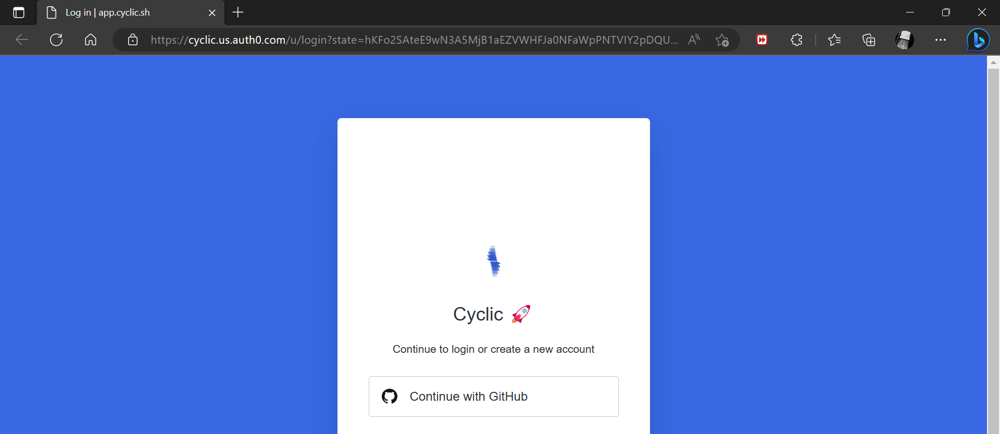
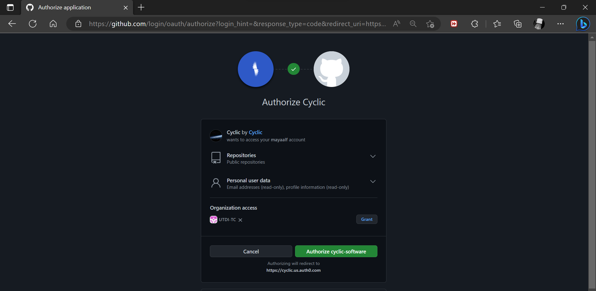
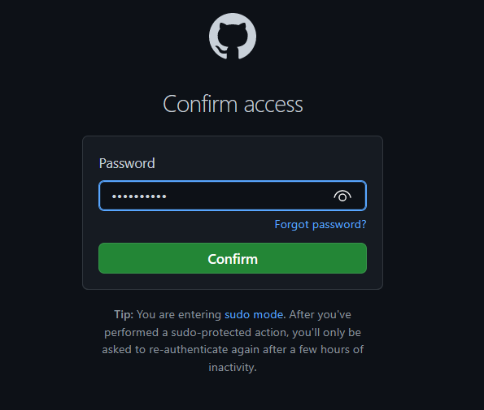
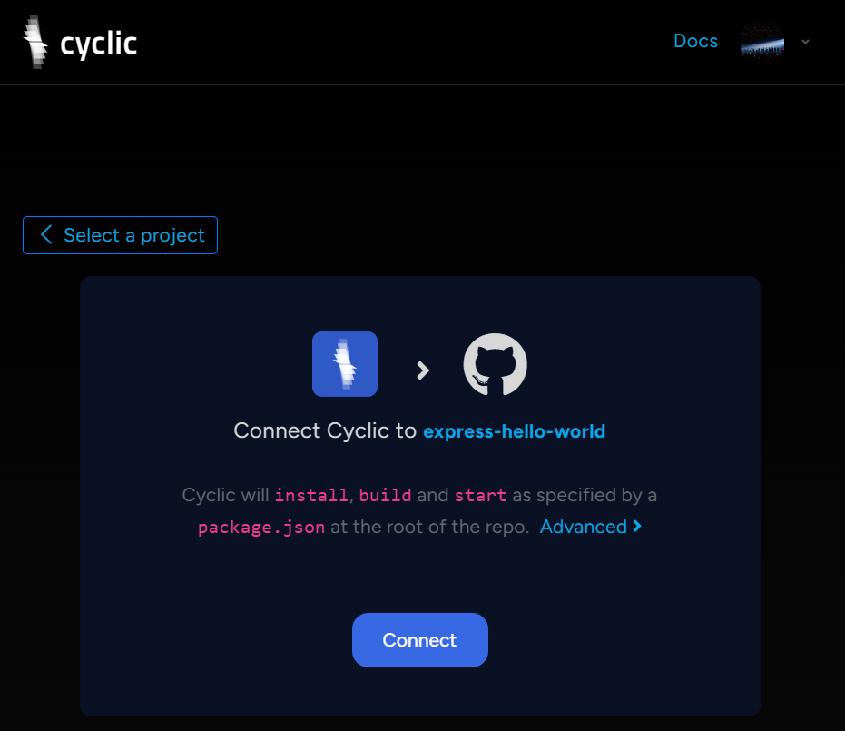
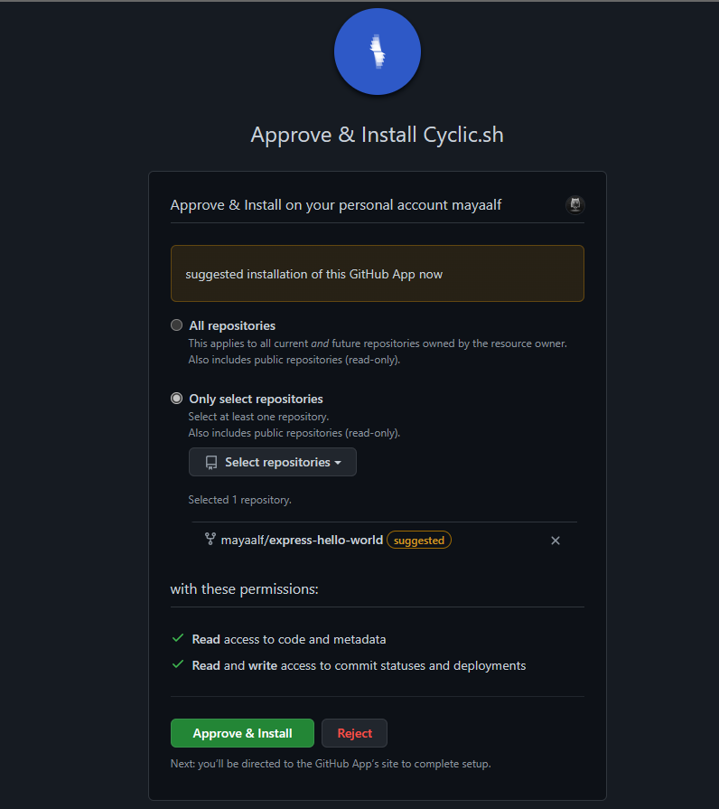

# Deploy Some Code - Quick Start - Deploy to Cyclic

1. Klik Ddeploy To Cyclic

    
    

2. Akan direct ke akun cyclic dan diminta untuk Continue with GutHub

    
    
3. Berikan izin untuk bergabung dengan Cyclic

    
    
4.  Masukkan password akses ke git anda

    
    
5.  Akan connect cycluc ke repository express-hello-world, lalu klik **Connect**

    
  
6.  Lalu akan ke tampilan approve & install Cyclic,sh, klik Approve & Install

    
