# Signup Heroku
1. Masuk dalam [URL Heroku](https://signup.heroku.com/) untuk membuat account

    
    

2. Setelah masuk pada link tersebut maka akan ditampilkan form pembuatan akun. Isikan data yang diminta lalu klik **create an account**

    
    

3. Buat akun akan diminta verifikasi email, bukalah gmail anda 

    
    

4. Buat password yang memenuhi 3 kriteria yang diminta oleh Heroku

    
    

5. Akun siap digunakan, klik **Click Here to Proceed*

    
    

# Getting Started on Heroku With Python

1. Login Heroku menggunakan command 

    
    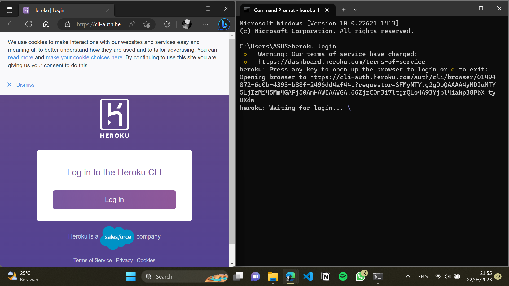

    
    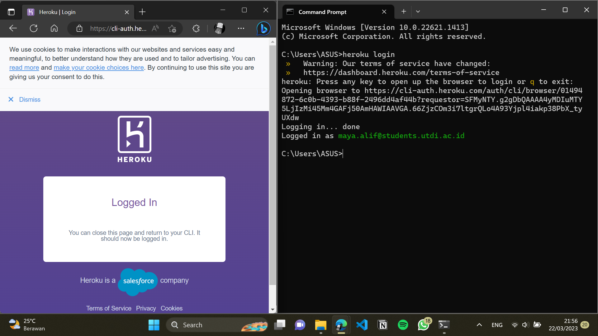

## Prepare The App

1. Clone contoh aplikasi pada penyimpanan lokal yang akan di deploy pada Heroku

    
    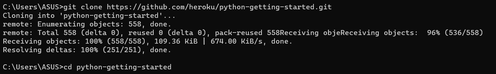

## Deploy The App

1. Membuat aplikasi pada Heroku

    
    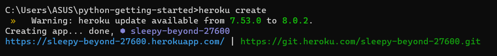

    
    Saat membuat aplikasi pada git remote 'heroku' akan terbentuk nama aplikasi secara random yang bernama 'sleepy-beyond-27600'.

2. Deploy 

    
    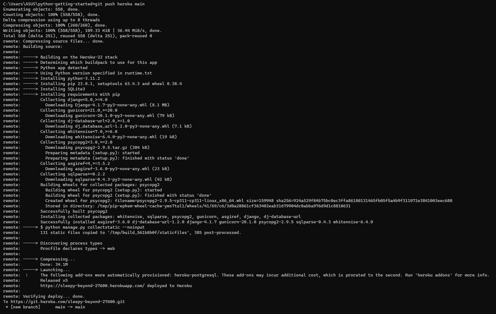

    
    Aplikasi sudah berhasil dideploy.

3. Membuka aplikasi pada website

    
    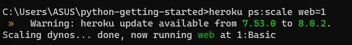

    
    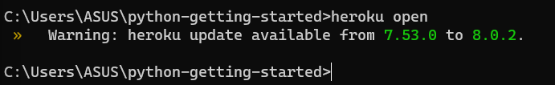

```Hasil : ```

    
   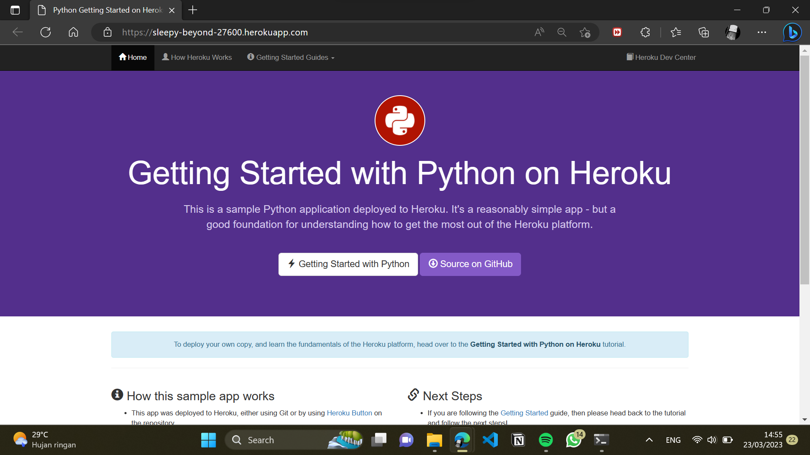


## View Logs

Melihat infromasi aplikasi dengan perintah logs ```heroku logs --tail```

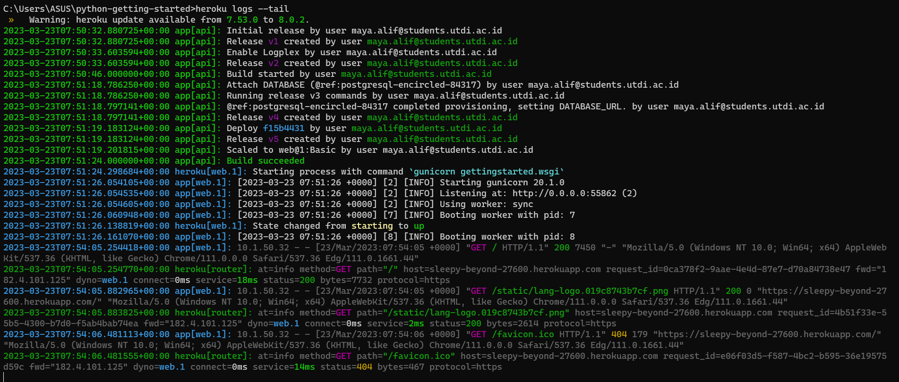

## Define Procfile

Procfile adalah file teks pada direktori root pada aplikasi. Contoh deploy aplikasi yang memiliki isi Procfile :

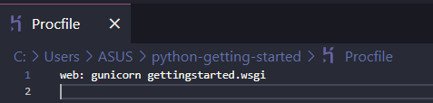

#### Microsoft Windows
Lokal deploy pada Microsoft Windows terletak pada file Procfile.windows

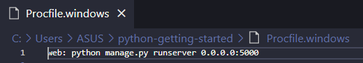

## Scale The App

Menjalankan web tungak Dyno dengan perintah ps ```heroku ps```

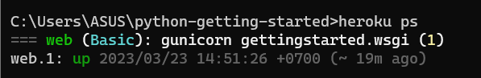

Skala aplikasi pada Heroku akan berubah jika dynos scale pada web menjadi 0

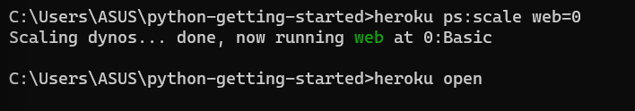

Kemudian ketikkan perintah ```heroku open```, lihatlah perubahan yang terjadi pada loading web browser.

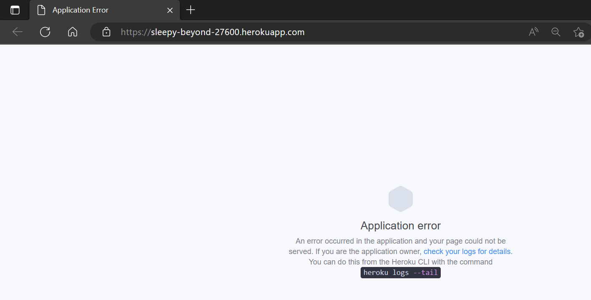

Sekarang kembalikan pengaturan pada scale web 1

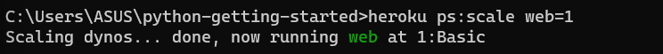

## Install App Dependencies Locally

Heroku mengenali aplikasi seperti aplikasi Python dengan melihat kata kunci file termasuk ```requirements.txt``` pada direktori root yang berisikan :

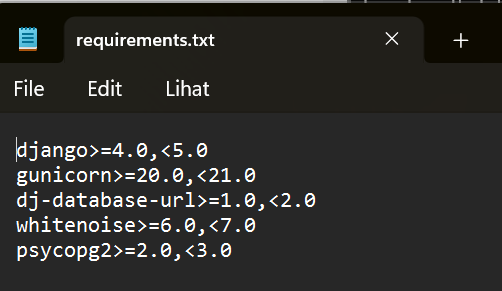

Heroku membaca file ini dengan perintah ```pip install -r```

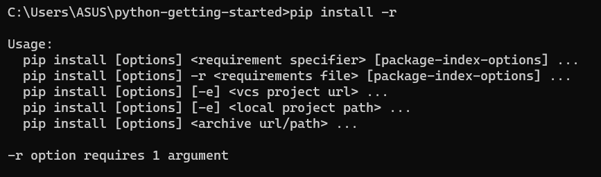

Install pada local dengan membuat *"Virtual Environment (venv)"* 

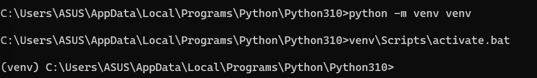

Pada akhir dapat menginstall pada environment baru dengan perintah :


## Run The App Locally

Aplikasi hampir siap untuk dimulai secara local. Menggunakan Django sehingga perlu running ```collectstatic```, respon dengan Y or yes.

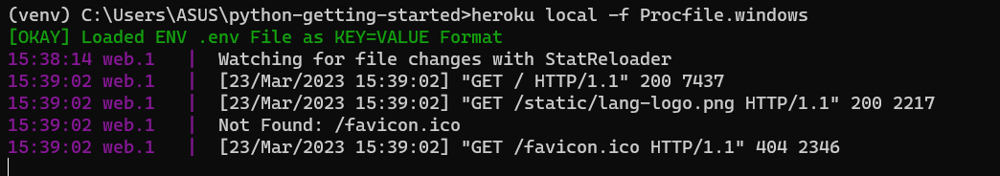

Hentikan program dengan ```ctrl``` + ```C```.

Jalankan dengan [https://localhost:5000] pada browser


## Push Local Changes

Modifikasi pada file ```requirements.txt``` dengan menambahkan ```requests```

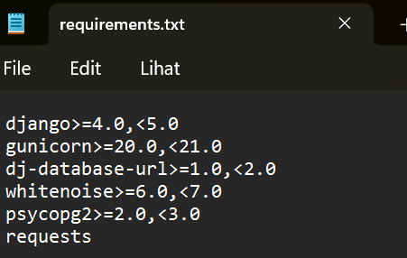

Update dengan perintah pip install

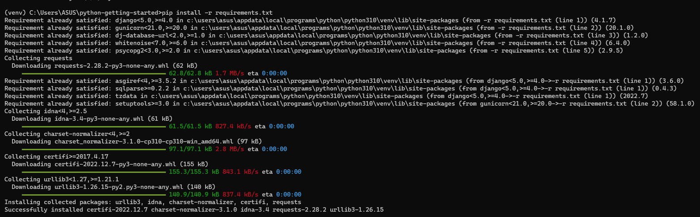

Ubahlah file views.py dalam direktori hello dengan modul requests

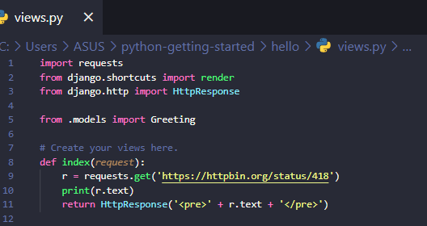
