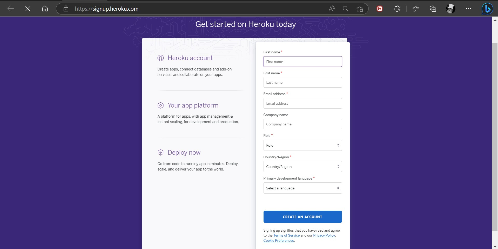
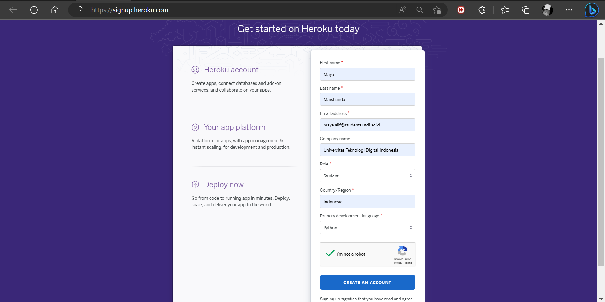
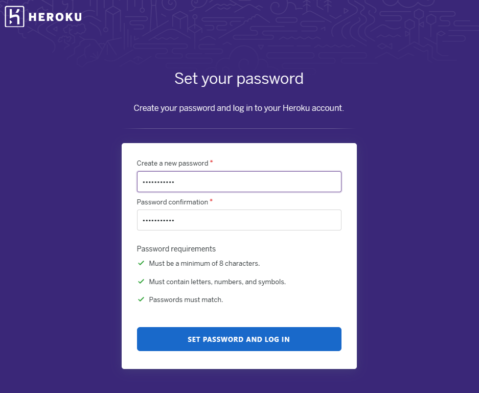

# Signup Heroku
1. Masuk dalam [URL Heroku](https://signup.heroku.com/) untuk membuat account

2. Setelah masuk pada link tersebut maka akan ditampilkan form pembuatan akun. Isikan data yang diminta lalu klik **create an account**

3. Buat akun akan diminta verifikasi email, bukalah gmail anda 

4. Buat password yang memenuhi 3 kriteria yang diminta oleh Heroku

5. Akun siap digunakan, klik **Click Here to Proceed*

# Getting Started on Heroku With Python

1. Login Heroku menggunakan command 

2. Cek php, composer dan git version

## Prepare The App

1. Clone contoh aplikasi pada penyimpanan lokal yang akan di deploy pada Heroku

## Deploy The App

1. Membuat aplikasi pada Heroku

2. Deploy 

3. Membuka aplikasi pada website

## View Logs
