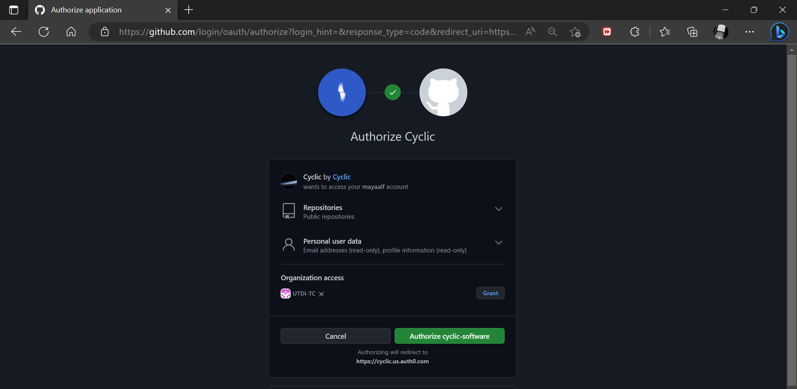
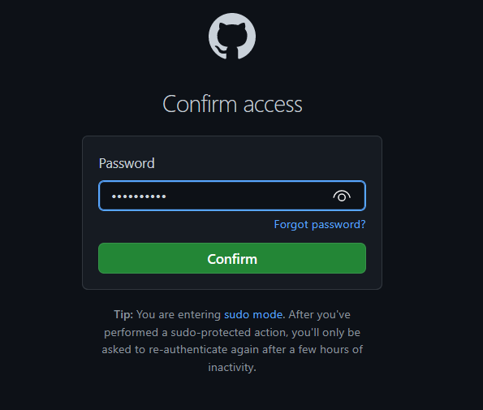
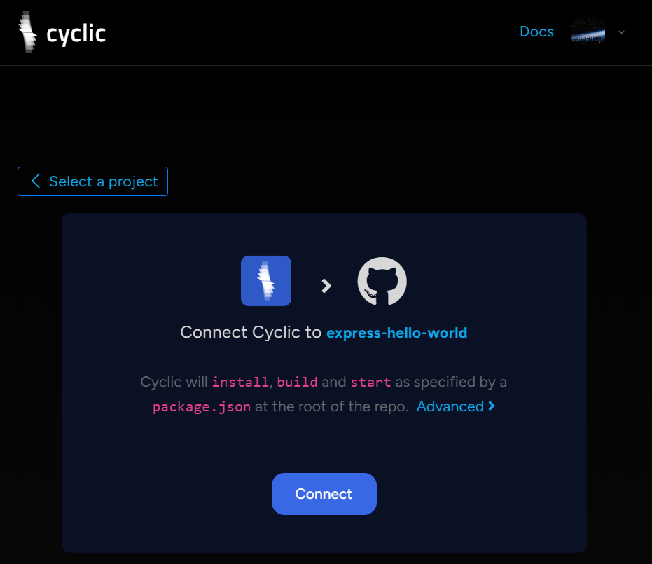

# Deploy Some Code - DIY

1. Klik [link ini](https://docs.cyclic.sh/) lalu scoll sampai menemukan **DIY** link : https://app.cyclic.sh/api/login

2. Akan direct ke akun cyclic dan diminta untuk Continue with GutHub

    
    
3. Berikan izin untuk bergabung dengan Cyclic

    
    
4. Membuat file package.json dan package-lock.json dengan cara
    
    -   ```npm init y``` untuk membuat file package.json
        
        
    
    -   ```npm i express mongoose dotenv``` untuk membuat file package-lock.json

        
        
        
5. Membuat file index.js untuk mendapatkan tampilan web yang akan dibangun

   
   
6. Jika semua file yang sudah dibutuhkan sudah lengkap maka push kedalam repository git

   
   
7. Kemudian kembali ke website cyclic. pada dashboard akan ditampilkan pilihan **Starter Tamplate** dan **Link Your Own**. Pilih yang **Link Your Own** dan pilihlah salah satu repository yang sudah memiliki file json. Disini akan menggunakan repository **awsome-project**.

        

8.  Masukkan password akses ke git anda

    
    
9.  Akan ditampilkan pilihan 

    
  
10. Lalu akan ke tampilan approve & install Cyclic,sh, klik Approve & Install

    
    
 11. Pembuatan untuk membentuk dan deploying berlangsung. Tunggu hingga proses selesai

     
     
 12. Ujilah aplikasi dengan link yang sudah disediakan

      
