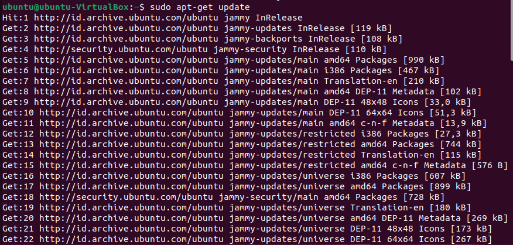
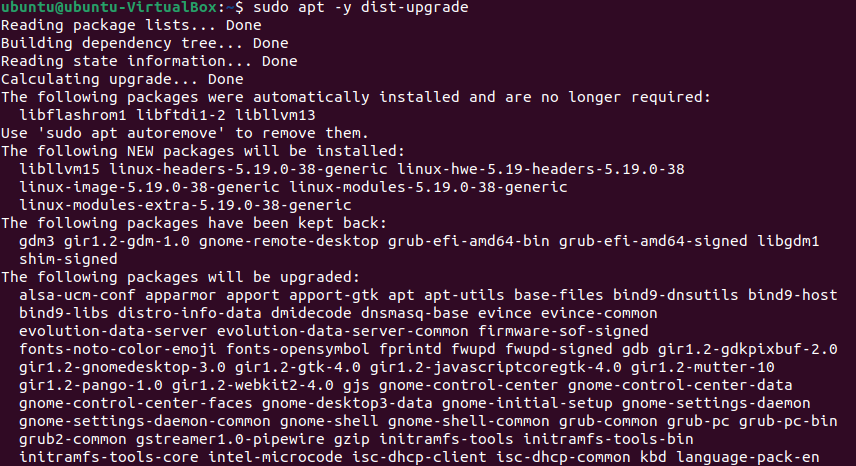
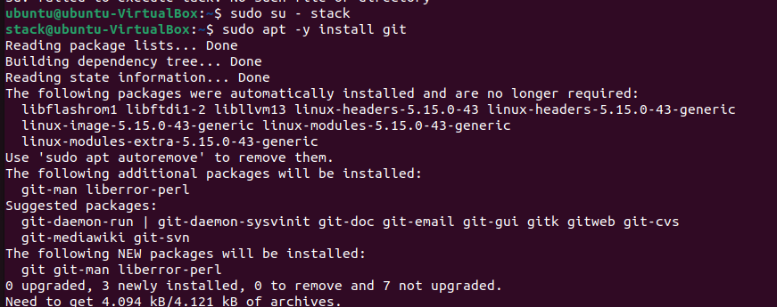
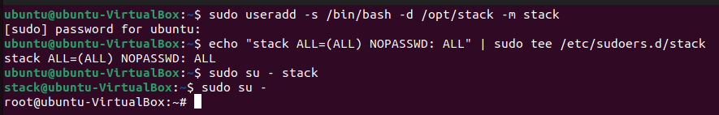
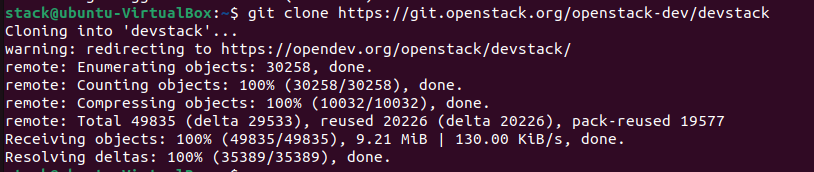
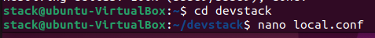
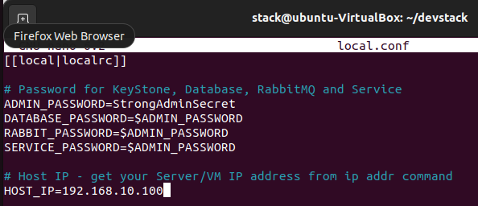
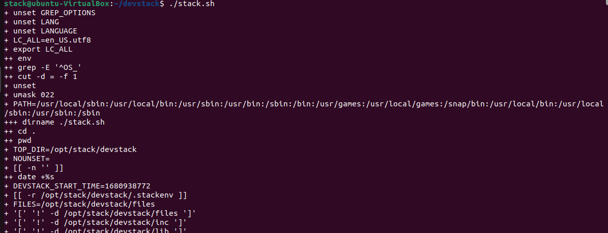

# OpenStack Deployment on Ubuntu with DevStack


## Step 1 : Update Sistem Ubuntu
Login pada sistem Ubuntu dengan VirtualBox dari terminal ketikkan perintah ini





Setelah selesai proses diatas, maka lakukan reboot, dengan menggunakan perintah 


## Step 2 : Menambahkan Stack User
Perintah yang digunakan adalah 



Gunakan perintah sudo untuk membuat akun tidak membutuhkan password. Setelah itu switch user dengan stack user



```
Perintah sudo su - stack digunakan untuk berpindah user stack, sedangkan sudo -su digunakan untuk beralih menggunakan root.
```
## Step 3 : Download Devstack
Pindahkan user dari root menjadi user stack kembali menggunakan perintah
```
su - stack
```
Kemudian, download git untuk mendapatkan Devstack dari github



Setekag sudah berhasil men-clone devstack, buatlah ```local.conf``` dengan 4 password dengan Host IP addressnya



Sudah terbentuk ```local.conf``` kemudian tambahkan beberapa konfigurasi sebagai berikut



## Step 1 : Memulai OpenStack di Ubuntu dengan DevStack

Memulai installasi Openstack dengan perintah



Dari perintah tersebut DevStack akan menginstall beberapa item seperti :
- Keystone - Identity Service
- Glance – Image Service
- Nova – Compute Service
- Placement – Placement API
- Cinder – Block Storage Service
- Neutron – Network Service
- Horizon – Openstack Dashboard

Penginstallan tersebut akan memakan waktu selama 15-20 menit sesuai dengan kecepatan internet yang digunakan.

## Step 5 : Akses OpenStack

Lalu akses OpenStack dengan menggunakan URL yang ada pada horizon
```
https://192.168.10.100/dashboard
```
