# Mininet WalkThrough

## Part 1: Penggunaan Mininet Setiap Hari

### Install Mininet

dengan menggunakan 

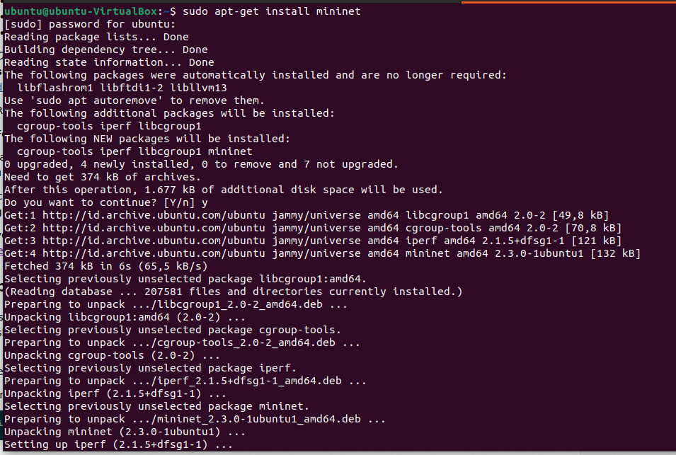

Perintah untuk mengambil mininet dari github dengan perintah

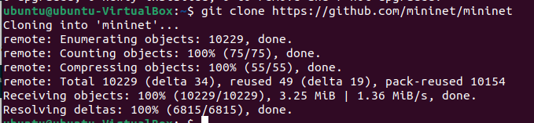

Kemudian jika mininet sudah berhasil terpasang maka masuk kedalam direktori mininet untuk mengetahui versi yang tersedia untuk di gunakan


Menginstall ```install.sh``` menggunakan mininet

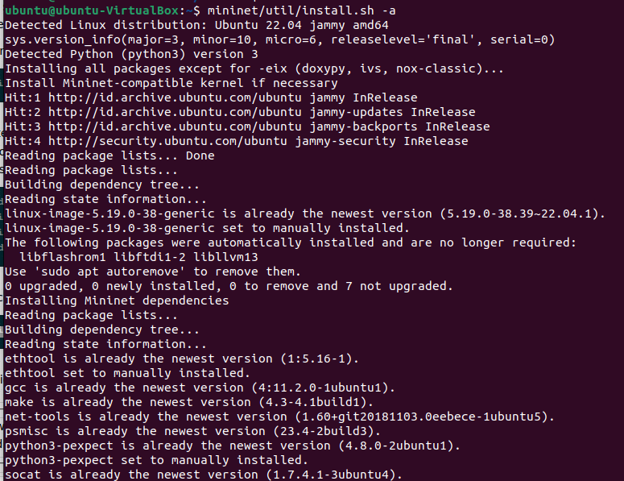

Memulai wireshark

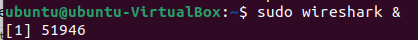

Menjalankan Wireshark dengan X11 tunneling dan ssh

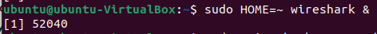

Display mininet command CLI :

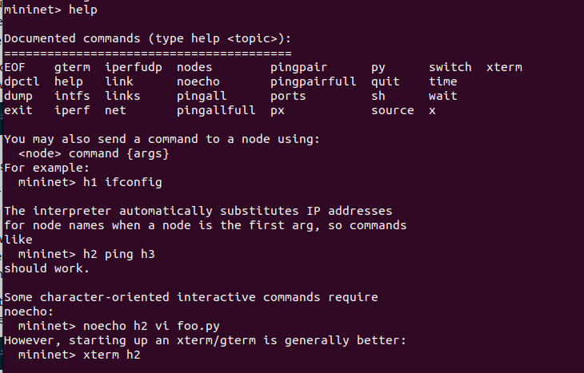


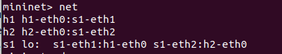

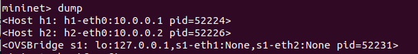

Menjalankan switch host yang ada di node

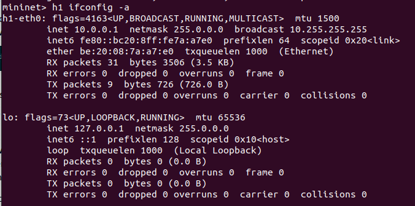

Menjalankan root network namespace

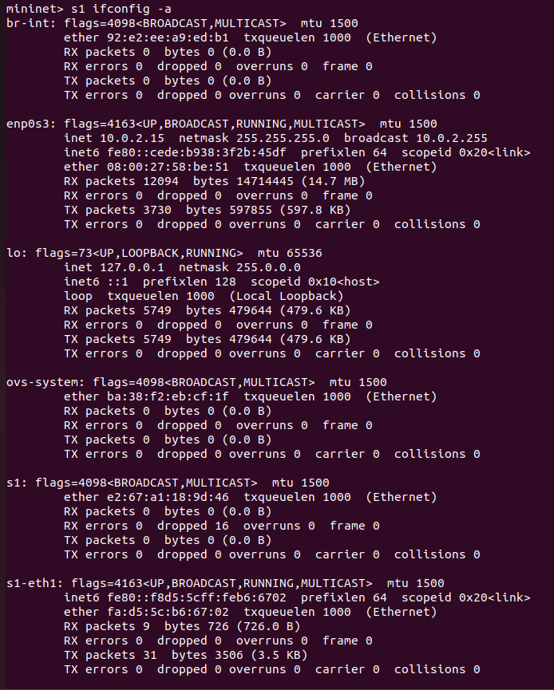

### Test Konektivitas dengan host

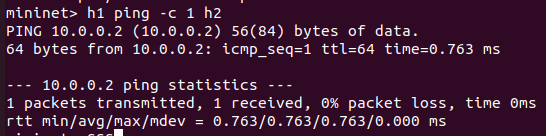

Cara mudah untuk menjalankan mininet CLI

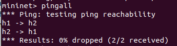


### Menjalankan Simple Web Server dan Client
Menggunakan simpel HTTPS pada server h1

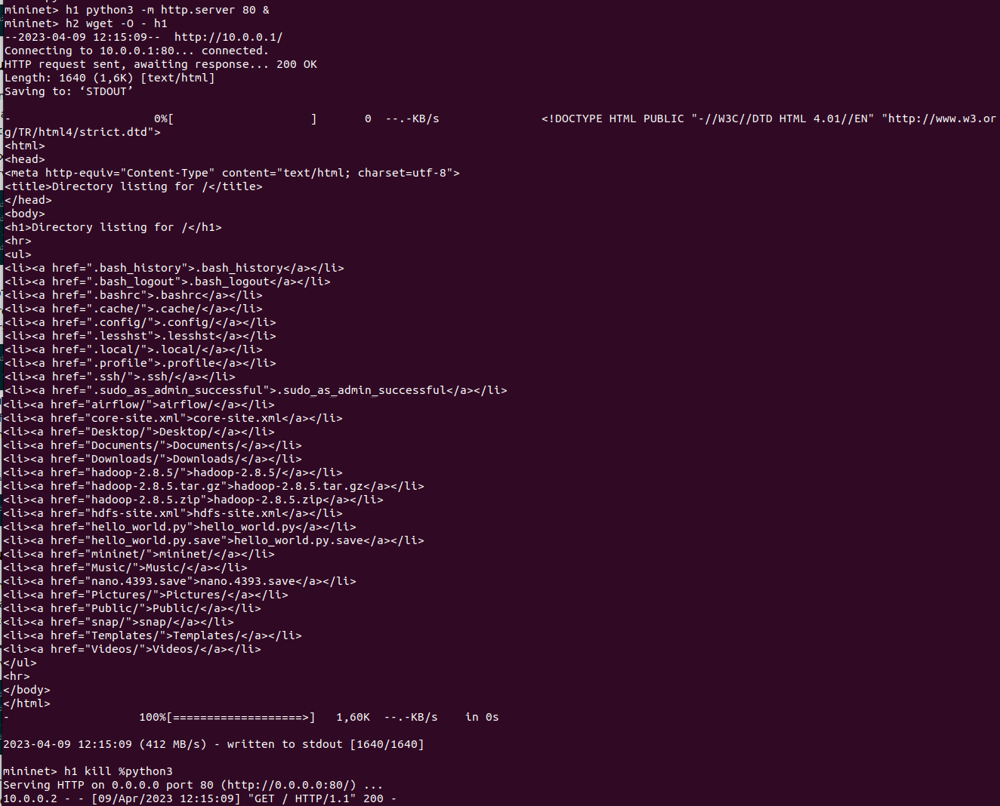

Untuk menampilkan Python verion yang sedang digunakan 

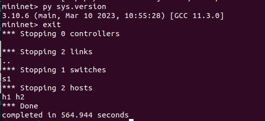

## Menjalankan Tes Regresi

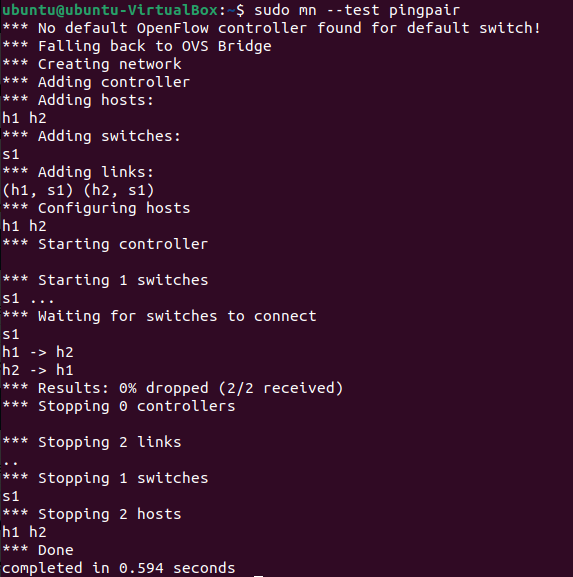

### Link Variasi

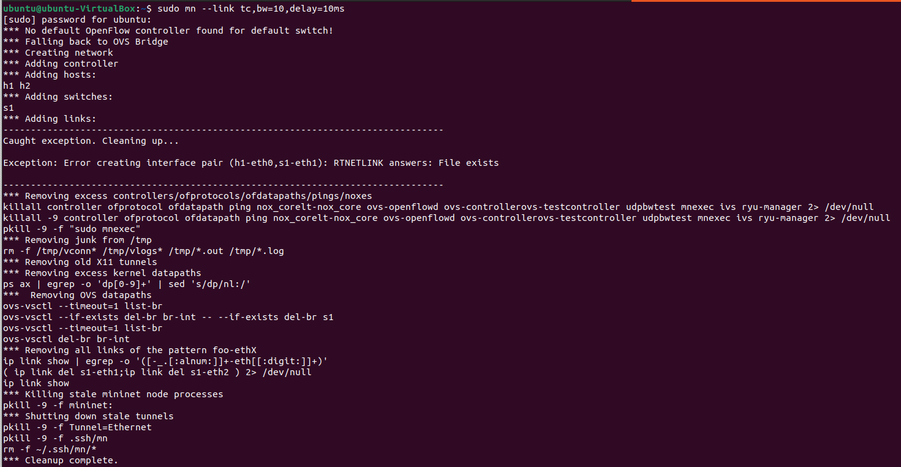

yang kemudian akan menampilkan windows baru dengan perkegarakannya

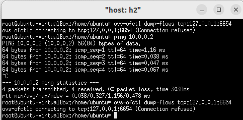


### XTerm Display
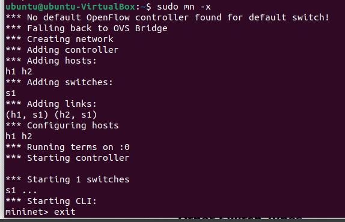

### Switch dengan tipe berbeda

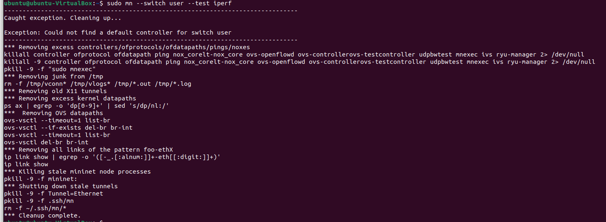
