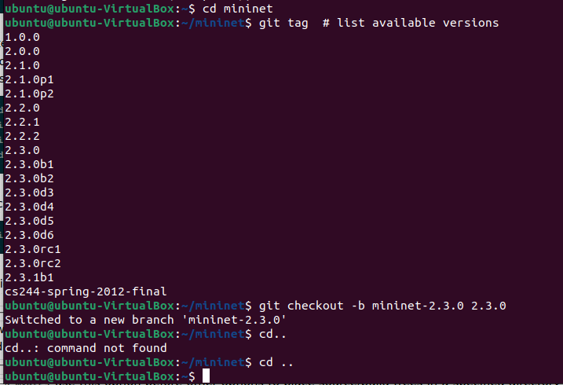

# Mininet WalkThrough

## Part 1: Penggunaan Mininet Setiap Hari

### Install Mininet

dengan menggunakan 


Perintah untuk mengambil mininet dari github dengan perintah


Kemudian jika mininet sudah berhasil terpasang maka masuk kedalam direktori mininet untuk mengetahui versi yang tersedia untuk di gunakan



Menginstall ```install.sh``` menggunakan mininet


Memulai wireshark


Menjalankan Wireshark dengan X11 tunneling dan ssh


Display mininet command CLI :


Menjalankan switch host yang ada di node


Menjalankan root network namespace


### Test Konektivitas dengan host


Cara mudah untuk menjalankan mininet CLI


### Menjalankan Simple Web Server dan Client
Menggunakan simpel HTTPS pada server h1


Untuk menampilkan Python verion yang sedang digunakan 


## Menjalankan Tes Regresi


### Link Variasi


yang kemudian akan menampilkan windows baru dengan perkegarakannya


### XTerm Display


### Switch dengan tipe berbeda


