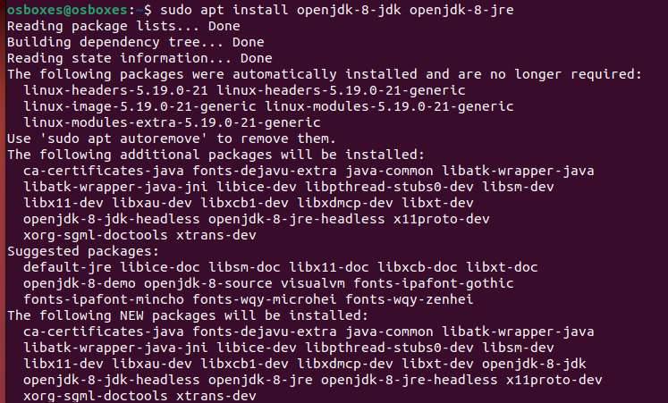

[ [<< Kembali](README.md) ]

# Install Apache OFBiz

## Install Java
1. Open terminal Ubuntu, lalu ketikkan kode berikut: 
    ```sudo apt install openjdk-8-jdk openjdk-8-jre```
    
    

2. Cek hasil installasi dengan perintah:
  ```java -version```
  

3. Konfigurasi Java Home dan Jre Home 
  
   

## Download Apache OFBiz
1. Download Apache OFBiz 
   ```
   wget https://dlcdn.apache.org/ofbiz/apache-ofbiz-18.12.07.zip
   ```
   
   
2. Extract folder zip yang telah didownload, lalu ikuti langkahnya sebagai berikut:
    
   

## Install Apache OFBiz
1. Jalankan perintah installasi sebagai berikut:
   ```
   cd /usr/local/apache-ofbiz 
    ./gradle/init-gradle-wrapper.sh 
   ```
    Perintah tersebut akan mendownload **gradle-wrapper.jar** dan diletakkan pada direktori **gradle/wrapper**.
    
    

2. Kemudian bersihkan sistem dan muat data OFBiz dengan lengkap menggunakan perintah **gredlew**. Perintah ini akam memakan waktu dalam prosesnya karena bergantung pada kecepatan koneksi internet masing-masing.

   
   
## Menjalankan Apache OfBiz Service
Setelah melakukan proses installasi, jalankan Apache OFBiz service pada sistem dengan perintah:


## Mengakses Apache OFBiz Pada Browser
Akses Apache OFBiz Pada Browser di port 8443 dan login dengan ketentuan:
- URL: https://server-ip-address:8443/myportal/control/main
- Admin Username: admin
- Admin Password: ofbiz


