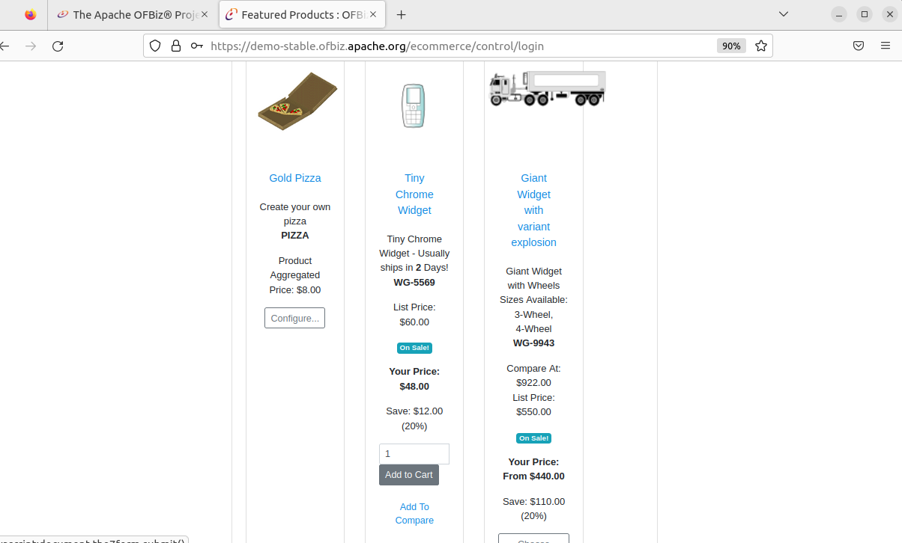
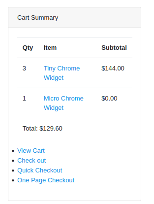

[ [<< Kembali](README.md) ]

# Menggunakan Demo Apache OFBiz
Masuk pada halaman [OFBiz Demo](https://ofbiz.apache.org/ofbiz-demos.html), lalu pilih demo yang akan digunakan. Pada praktik kali ini menggunakan [Demo Front End E-Commerce Webstore](https://demo-stable.ofbiz.apache.org/ecommerce/control/main) yang akan tertampil seperti ini.

## Login Demo Apache OFBiz
Klik Login pada kiri atas website dan isikan 
- user name = admin
- password = ofbiz

## Pilih Item Yang Akan Dibeli
1. Kali ini akan membeli item **Tiny Chrome Widget** pilih jumlah yang akan dipesan lalu klik **Add to Chart**.

   

2. Untuk melihat barang yang sudah dimasukkan dalam chart dapat terlihat di sisi kanan atas, atau klik **View Chart**

   
   
   Kemudian klik **Check Out**
   
3. Isilah data pengiriman dengan **New Address**, isikan data dengan benar lalu klik save
   
     
   
   
 
4. Kembali ke menu chart dan checkout kemudian lanjutkan pemilihan alamat, ekspedisi pengiriman dan metode pembayaran. Ketika semua sudah terisi dengan benar lanjutkan dengan klik **Continue to Final Order Review**

   
   
   
   
5. Lanjut pada halaman **Final Order Review** jika dirasa semua informasi pengiriman sudah benar maka klik pada button **Submit Order**

   
   
   
 6. Pesanan akan terkonfirmasi dan dapat dilihat dari menu **Order History**

    
    
