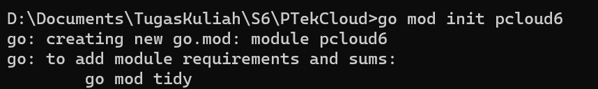
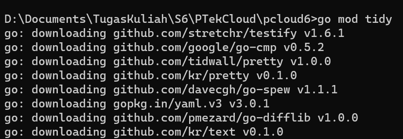
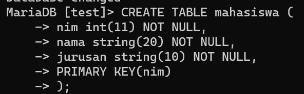
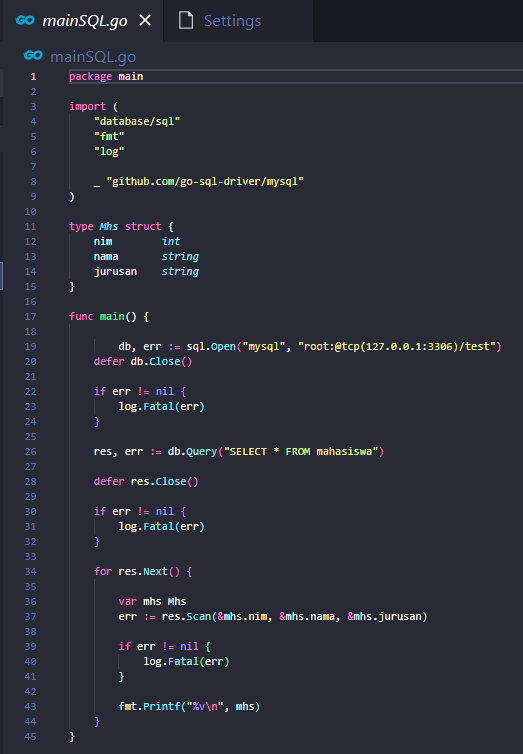
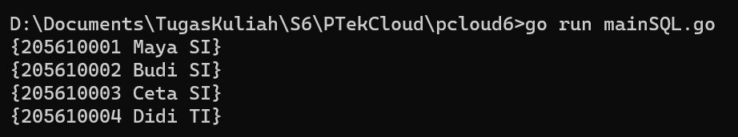
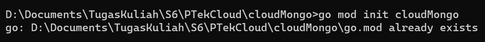
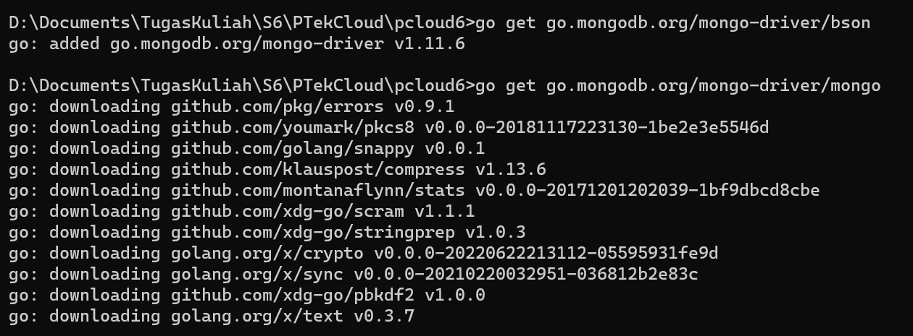
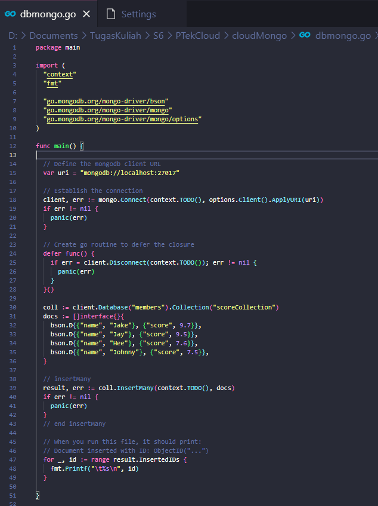
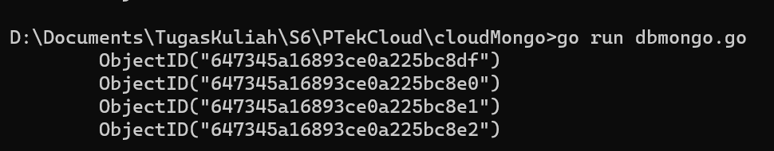
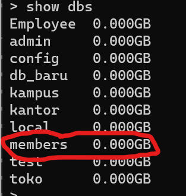

# Installasi Software

## Install GO Programming Language

1. Masuk pada [URL download GO](https://go.dev/dl/), lalu pilih fitur yang sesuai dengan spesifikasi laptop yang dimiliki

    

2. Setelah proses download berhasil, lalu lakukan proses installasi. Klik **Next**

    
    
3. Klik _'I accept the terms in the License Agreement'_. Klik **Next**

    
    
4. Pilihlah lokasi penyimpanan untuk install GO. Klik **Next**

    

5. Klik **Install** lalu tunggulah proses installasi sampai selesai. Klik Finish

    
    
    
    
    
        
## Install MySQL

1. Masuk pada [URL download MySQL](https://www.mysql.com/products/community/), lalu klik _MySQL Intsaller Windows_ dan kemudian pilih fitur yang sesuai dengan spesifikasi laptop yang dimiliki

    
    
    
    
    

2. Setelah proses download berhasil, lalu lakukan proses installasi. Klik **Next**

    
    
3. Pilihlah lokasi penyimpanan untuk install GO. Klik **Next**

    

5. Klik **Next** lalu klik **Execute** tunggulah sampai proses download paket selesai. Klik Finish

    
    
## Install MongoDB

1. Masuk pada [URL download MongoDB](https://www.mongodb.com/try/download/community), lalu pilih fitur yang sesuai dengan spesifikasi laptop yang dimiliki

    

2. Setelah proses download berhasil, lalu lakukan proses installasi. Klik **Next**

   
    
3. Klik _'I accept the terms in the License Agreement'_. Klik **Next**

    
    
4. Pilihlah tipe Complete untuk konfigurasi MongoDB. Klik **Next**

    
    
    
    
5. Klik **Install** lalu tunggulah proses installasi sampai selesai. Klik Finish

    
    
    
   

# Program Koneksi dan Baca Data Pada MySQL dan MongoDB 
## Program Koneksi dan Baca Data Pada MySQL
 
1. Buatlah folder kerja untuk membuat file kerja koneksi MySQL bernama **pcloud6**
2. Masuk pada cmd untuk insialisasi folder projek dengan mengetikkan perintah seperti berikut :

    

3. Ketikkan perintah untuk mengunduh library mysql 

    
 
4. Ketikkan perintah mod tidy untuk melakukan validasi dependensi.

    
    
5. Membuat database bernama **test** dengan nama tabel **mahasiswa** 

    
    
6. Ketikkan code dengan menggunakan library dari database mysql untuk nantinya dapat dibaca data yang telah tersimpan dalam database.

    
    
7. Jalankan perintah untuk membaca file database yang sudah dibuat

    
    
    
## Program Koneksi dan Baca Data Pada MongoDB 

1. Membuat inisailisas folder projek kerja yang bernama cloudMongo

    
   
2. Ketikkan perintah untuk mengunduh library mongoDB

    
    
3. Ketikkan code dengan menggunakan library dari database mongoDB untuk nantinya dapat dibaca data yang telah diinputkan untuk tersimpan pada database

    

4. Jalankan perintah untuk membaca file database yang sudah dibuat

    

5. Cek kembali pada cmd mongoBD untuk memastikan database sudah terbuat dengan baik dengan perintah ```show dbs```

    
    

