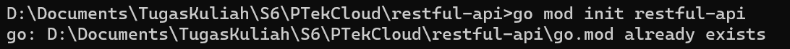
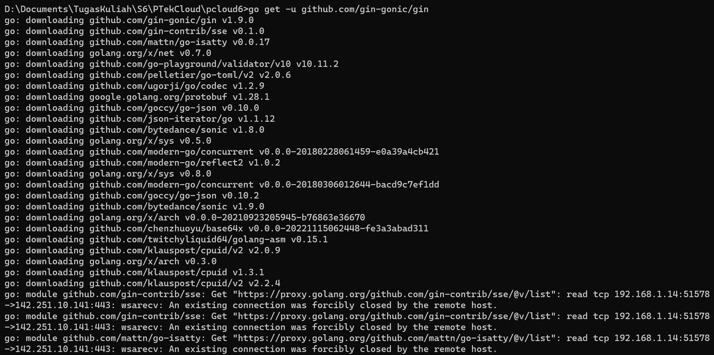
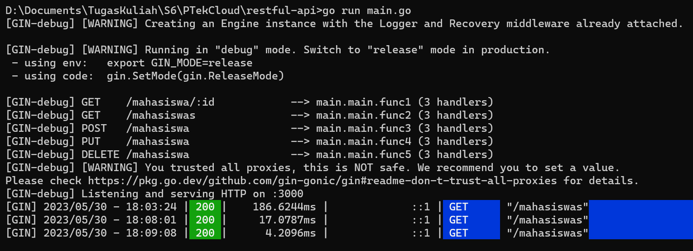
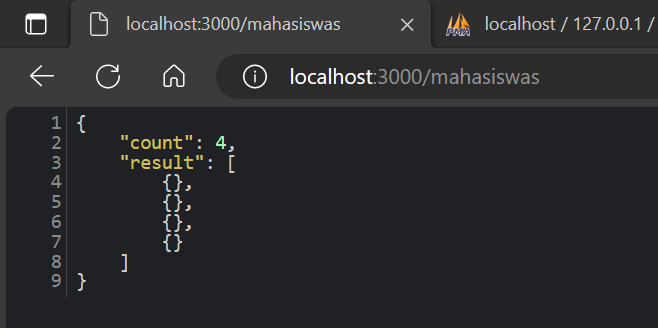

# RestfulAPI Untuk Membaca Data Dari MySQL dan MongoDB

## RestfulAPI MySQL

1. Buat folder bernama restful-api kemudian inisialisasi menggunakan perintah init

   

2. Download library gin agar nantinya bisa menjalankan dan membaca data MySQl

   

3. Buatlah code dengan nama file [main.go](main.go)
4. Jalankan perintah untuk menjalankan file main go

  
  
5. Buka browser dan jalankan pada localhost:3000/mahasiswas

  
  
## RestfulAPI MongoDB
