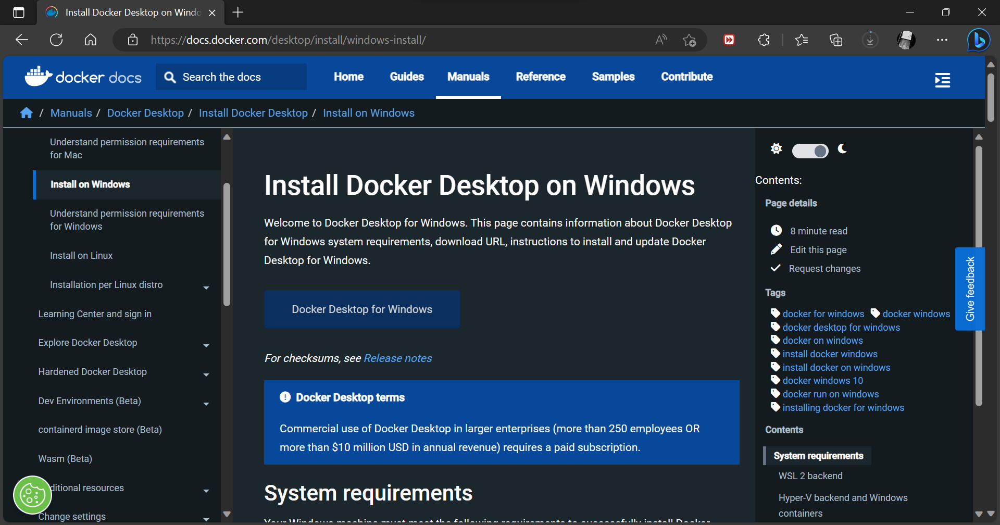

# Installasi Docker

1. Masuk pada halaman [Docker](https://docs.docker.com/get-docker/) untuk mendapatkan aplikasi Docker sesuai dengan spesifikasi yang dimiliki.

  

2. Jika file sudah selesai terdownload lanjutkan proses installasi sampai selesai 

  
  
  

3. Jika proses installasi sudah selesai klik _'Close and restart'_ agar Docker dapat bekerja dengan baik dalam komputer.

  

# Get Started With Docker

1. Lakukan proses login Docker

  
  
  
  
2. Update subsistem windows untuk dipasang sistem Linux

  
  
3. Proses Login berhasil dilakukan, Docker dapat digunakan

  
  
4. Clone repository getting-started dengan perintah sebagai berikut 

  
 
 5. Masuk pada folder getting-started/app dan akan terlihat file package.json dan 2 subdirectory bernama src dan spec

  
  
  6. Masuk pada directory getting-started/app kemudian ketikkan perintah ```type nul > Dockerfile``` untuk membuat file kosong bernama Dockerfile

  
  
 7. Gunakan editor untuk menambahkan kode seperti berikut 
```
# syntax=docker/dockerfile:1
   
FROM node:18-alpine
WORKDIR /app
COPY . .
RUN yarn install --production
CMD ["node", "src/index.js"]
EXPOSE 3000
```

  
