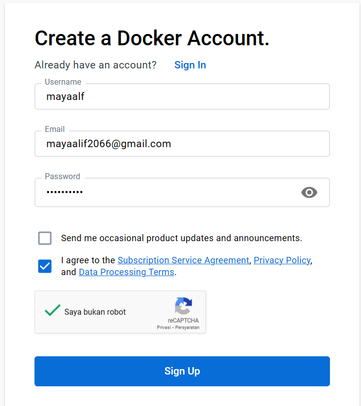

# Installasi Docker

1. Masuk pada halaman [Docker](https://docs.docker.com/get-docker/) untuk mendapatkan aplikasi Docker sesuai dengan spesifikasi yang dimiliki.
   

2. Jika file sudah selesai terdownload lanjutkan proses installasi sampai selesai 

   
  
    

3. Jika proses installasi sudah selesai klik _'Close and restart'_ agar Docker dapat bekerja dengan baik dalam komputer.

   

# Get Started With Docker

1. Lakukan proses login Docker

   
  
    
  
2. Update subsistem windows untuk dipasang sistem Linux

    
    
3. Proses Login berhasil dilakukan, Docker dapat digunakan

    
  
4. Clone repository getting-started dengan perintah sebagai berikut 

    
 
 5. Masuk pada folder getting-started/app dan akan terlihat file package.json dan 2 subdirectory bernama src dan spec

    
  
6. Masuk pada directory getting-started/app kemudian ketikkan perintah ```type nul > Dockerfile``` untuk membuat file kosong bernama Dockerfile

    
  
 7. Gunakan editor untuk menambahkan kode seperti berikut 
      ```
      # syntax=docker/dockerfile:1

      FROM node:18-alpine
      WORKDIR /app
      COPY . .
      RUN yarn install --production
      CMD ["node", "src/index.js"]
      EXPOSE 3000
      ```

    
8. Membuat container image menggunakan perintah sebagai berikut 
    ```
    docker build -t getting-started .
    ```
    
    
    
## Menjalankan App Container

1. Jalankan Docker dengan perintah ```docker run```  dan spesifik nama image yang dibuat 
    ```
    docker run -dp 3000:3000 getting-started
    ```
    
    

2. Setelah itu buka browser dan masuk pada http://localhost:3000

    
    
3. Cobalah untuk mengisikan data
    
    
    
 4. Jalankan perintah ```docker ps``` pada terminal untuk mengetahui list container yang telah dibuat

    
    
    
## Update Aplikasi

1. Update aplikasi dengan mengubah beberapa line code pada file app.js

    

2. Buatlah updated versi dari image dengan nama docker build dengan perintah 
    ```
    docker build -t getting-started .
    ```
   
    
    
3. Jalankan container baru. Akan terlihat pesan error pada ID yang berbeda. Kenapa terjadi error? hal ini dikarenakan container lama yang masih berjalan sehingga tidak dapat menjalankan container baru.
    
    
    
## Menghapus Container Lama

1. Jalankan perintah ```docker ps``` 

   

2. Gunakan perintah ```docker stop``` untuk menghentikan container

   

3. Hapus container dengan perintah ```docker rm```

    
    
    
## Jalankan App Container Terbaru

1. Jalankan perintah docker ```docker run``` untuk menjalankan container terbaru

    
    
2. Refresh browser untuk menjalankan kembali https:localhost:3000

    
