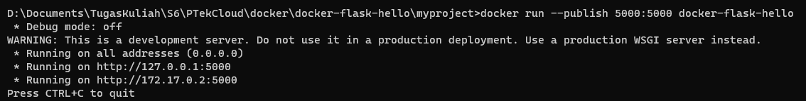

# Menjalankan DockerHub Menggunakan Python


1. Menjalankan perintah ```docker run hello-world```

    
    
2. Membuat aplikasi Flask sederhana. Sebelum itu buat Python virtual environment dan install flask

    

3. Jalankan perintah **pip freeze > requirements.txt**

    
    
    Yang akan tertampil suatu file berisikan
    
    
    
4. Buat file app.py 
    ```
    from flask import Flask

    app = Flask(__name__)

    @app.route("/")
    def hello_world():
    return "<p>Hello, World!</p>"
    ```
    
    
    
 5. Jalankan perintah program flask run tanpa docker

    

6. Buat file Dockerfile untuk membuat image custom dari aplikasi flask

    ```
    # Base Image untuk aplikasi kita
      FROM python:3.8-slim-buster


      # Menginstruksikan docker untuk menggunakan path ini di dalam
      # container kepada perintah-perintah selanjutnya
      WORKDIR /app


      # Sebelum menginstall requirements, kita perlu mengcopy filenya
      # ke dalam container
      COPY requirements.txt requirements.txt


      # Perintah RUN digunakan untuk menjalankan perintah di dalam
      # container. Seluruh perintah yang ada di dalam file ini bersifat
      # build-time yang artinya hanya akan dijalankan saat membuat image
      RUN pip install -r requirements.txt


      # Pada tahapan ini, kita sudah memiliki image yang berbasiskan
      # Python 3.8 dan kita telah menginstall dependency-nya. Sekarang
      # bisa kita pindahkan seluruh kode ke dalam container
      COPY . .


      # Terakhir, kita perlu memberitahukan Docker perintah apa yang
      # akan diberikan jika image ingin dijalankan di dalam kontainer
      CMD [ "python", "-m" , "flask", "run", "--host=0.0.0.0"]
    ```
    
    
    
 7. Jalankan perintah docker build 
    ```
    docker build --tag docker-flask-hello .
    ```
    
    
    
 8. Setelah proses berhasil, jalankan image sebagai container dengan perintah berikut 

    ```
    docker run --publish 5000:5000 docker-flask-hello
    ```
    
    
    
 9. Buka browser dan masuk pada [http://localhost:5000](http://localhost:5000)

    
