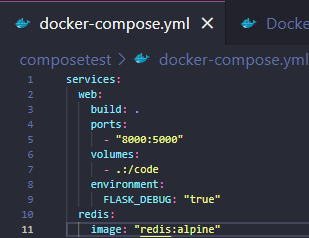

# Getting Started - Docker Compose

## Langkah 1: Membuat Depedensi Aplikasi
1. Buat diretori untuk projek 

    
    
2. Buat file bernama app.py dalam folder projek dan paste code ini :
    
    
    
3. Buat file lain bernama requirements.txt pada projek 

    
 
## Langkah 2: Buat Dockerfile

Dockerfile digunakan untuk membuat image yang berhubungan dengan Python. Buat file Docker file


## Langkah 3: Definisikan Service dalam Compose File
Buatlah file bernama docker-compose.yml dalam project 


## Langkah 4: Bangun dan Jalankan Aplikasi dengan Compose

1. Dari lokasi direktori projek jalankan perintah ```docker compose up```

    
    
    
2. Jalankan URL [http://localhost:8000/](http://localhost:8000) pada browser dan lihat apa yang ditampilkan

    
    
3. Refresh browser dan angka yang durampilkan berubah mengikuti perhitungan

    
    
4. Pindah ke terminal yang berbeda untuk menjalankan perintah ```docker image ls```

       
    
5. Hentikan aplikasi dengan perintah ```docker compose down``` atau dengan klik CTRL + C pada terminal

    
    
## Langkah 5: Edit File Compose dan Tambahkan Bind Mount
Edit file docker-coompose.yml



## Langkah 6: Re-Build dan jalankan Aplikasi dengan Compose
1. Jalankan aplikasi dengan mengetikkan perintah ```docker compose up```

    
    
2. Cek pada Hello World pada browser, refresh dan lihat jumlah dari increment

    
    
 ## Langkah 7: Update Aplikasi
 
 1. Ganti salam pada file app.py dari ```Hello World``` menjadi ```Hello From Docker```
 
     
     
 2. Jalankan kembali browser dengan cara refersh dan akan terlihat perubahan yang sudah dilakukan

      
      
## Langkah 8: Percobaan dengan Beberapa Perintah
1. Perintah ```docker compose run``` akan mengizinkan untuk run-one-off dari servis. Contoh :

    
    
2. Jika menjalankan Compose dengan perintah ```docker compose up -d```, sedangkan untuk menghentikan servis menggunakan perintah ```docker compose stop```

    
    
 3. Untuk menghapus container menggunakan perintah ```down``` dilanjutkan dengan ```--volumes```

    
