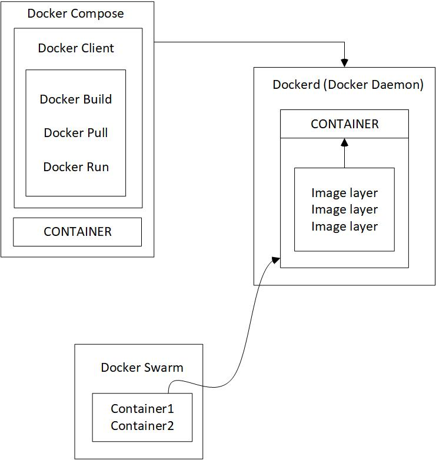

# Diagram Docker

Penjelasan Keterkaitan :

1. Docker Image adalah file berisi informasi dan petunjuk untuk membangun container. Image juga berfungsi untuk menggunakan dan mengirimkan informasi.
2. Container adalah lingkungan untuk mengemas dan menjalankan aplikasi. Ini mencakup kode, runtime, system tools, dan pengaturan.

    Sehingga ketrkaitan docker image dan container adalah image tidak akan terbentuk tanpa adanya containers, sehingga jika tidak ada image container tidak akan berjalan karena resource tidak ditemukan.

3. Docker Demon adalah proses pengelolaan Docker images, container, network, dan storage volumes. Docker daemon menerima request dari Docker API dan akan memprosesnya.
4. Docker Client adalah tempat di mana pengguna dapat mengirimkan perintah seperti Docker build, Docker pull, dan Docker run kepada Docker daemon.
5. Docker Compose adalah alat untuk mendefinisikan dan menjalankan satu atau beberapa container yang saling terkait dengan sebuah command.
6. Docker Swarm adalah eknologi clustering untuk manajemen banyak docker host atau mungkin disebut juga sebagai tools orkestrasi, host atau mesin mesin yang terinstall docker dan join ke dalam klaster yang sama disebut node. node sendiri terbagi menjadi 2 yaitu node manager dan node worker.
