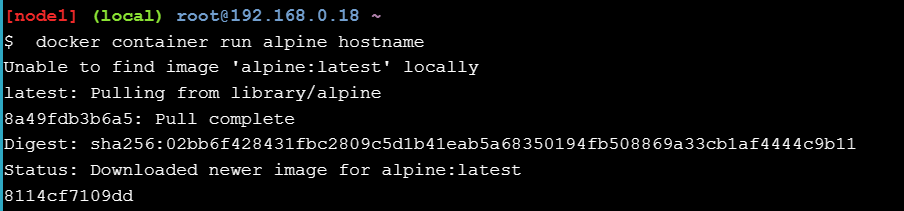

# Docker for Beginners - Linux

## Step 1: Prerequisites
### Clone repositori 

## Step 2: Menjalankan beberapa container sederhana Docker
### Menjalankan satu tugas dalam container Alpine Linux
1. Jalankan perintah dalam konsol

        
