# Docker for Beginners - Linux

## Task 0: Prerequisites
### Clone repositori 

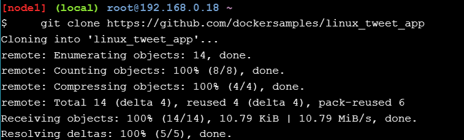

## Task 1: Menjalankan beberapa container sederhana Docker
### Menjalankan satu tugas dalam container Alpine Linux
1. Jalankan perintah dalam konsol

        

2. Menampilkan docker container yang berjalan selama proses dimulai

    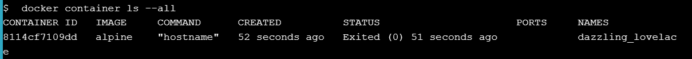
    
   **Nota**: ID kontainer adalah nama host yang ditampilkan kontainer. Dalam contoh di atas adalah *8114cf7109dd*
   
### Menjalankan kontainer Ubuntu interaktif
1. Menjalankan vontainer docker dan akses shell

    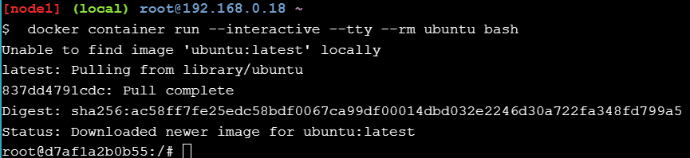
 
2. jalankan perintah berikut dalam container

    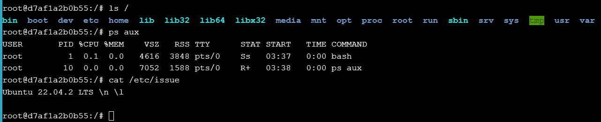
   
3. Ketik **exit** untuk menghentikan sesi shell
 
    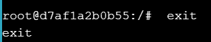
    
4.Menjalankan untuk memeriksa versi VM host

   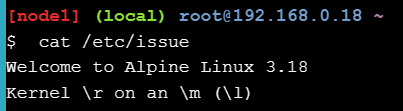
   
### Menjalankan Background Container MySQL 
1. Menjalankan container MySQL dengan perintah

    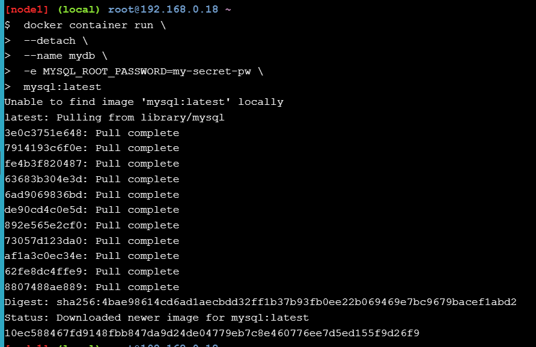
 
2. Mencantumkan container yang sedang berjalan

    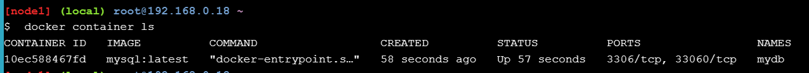
    
3. Memeriksa log dari container MySQL Docker

    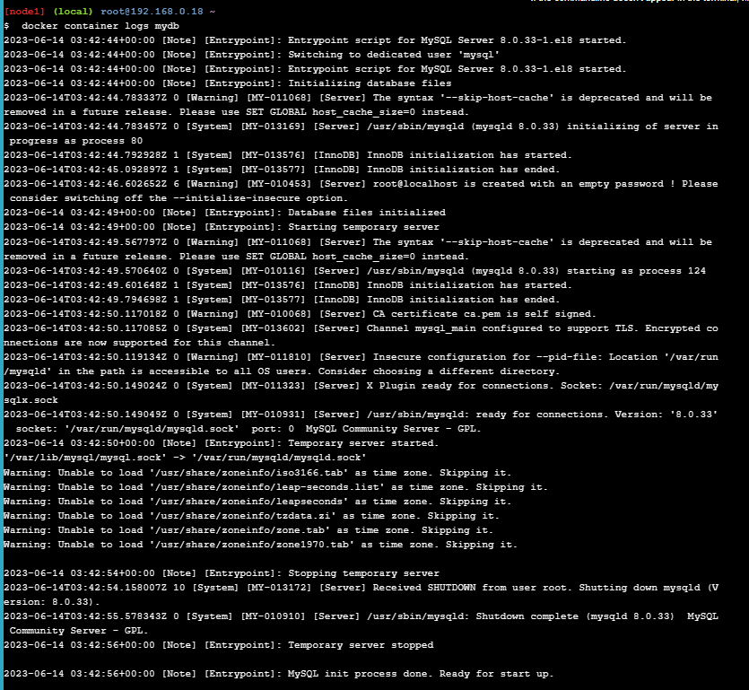   
    
    Jalankan perintah untuk melihat proses yang berjalan pada container
    
    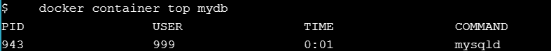
    
4.  Cantumkan versi MySQL dengan menggunakan perintah dibahawh ini
    
    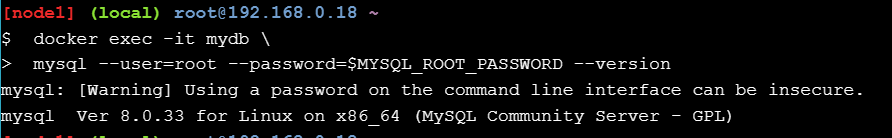
    
5. Menyambungkan proses shell dalam container yang sudah berjalan
    
    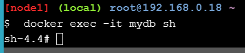
    
6. Periksa nomor versi dengan menjalankan perintah yang sama dalam sesi shell baru dalam container
    
    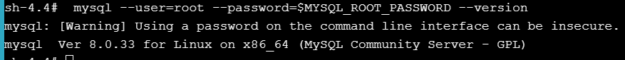  
    
7. Ketik **exit** untuk menghentikan sesi shell
 
    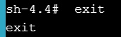    
    
## Task 2: Mengemas dan menjalankan aplikasi kustom menggunakan Docker
### Membuat gambar situs web sederhana
1. Pastikan sudah berada pada direktori **linux_tweet_app**

    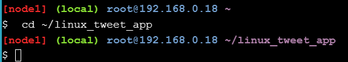
    
2.  Menampilkan konten yang ada dalam Dockerfile

    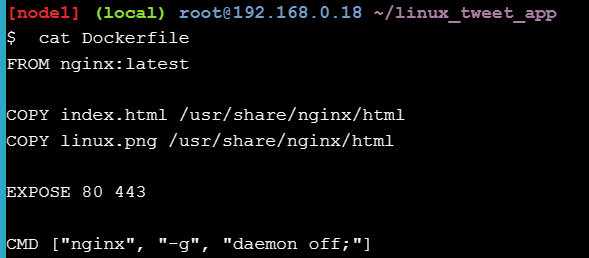  
    
3. Menjalankan perintah ```export DOCKERID=<your docker id>``` untuk mengekspor variabel lingkungan yang ada dalam DockerID
    
    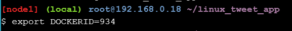
    
4. Mencetak nilai variabel untuk memastikan disimpan dengan benar

    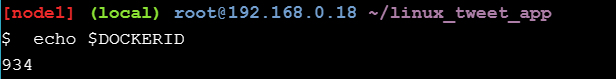 
    
5. Menggunakan perintah untuk membuat image Docker baru dengan menggunakan perintah berikut

   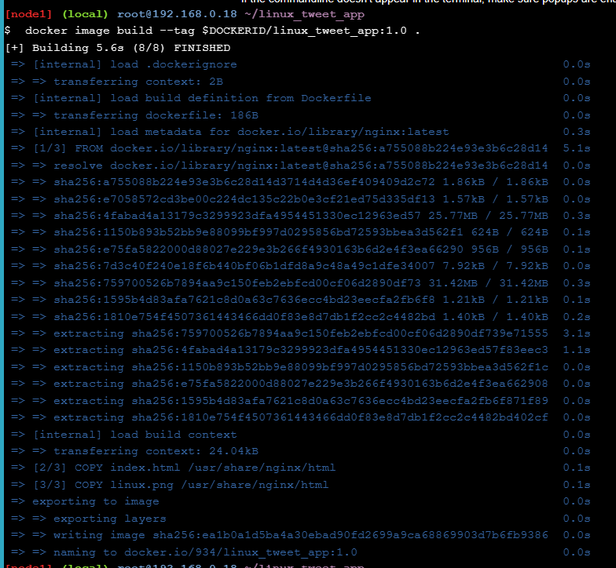    
   
6. Perintah menjalankan container baru

   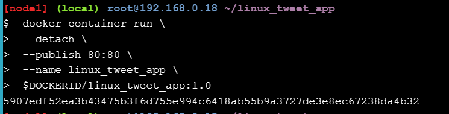 
   
7. Klik [website](http://ip172-19-0-3-ci4jndggftqg00ehj120-80.direct.labs.play-with-docker.com/) untuk memastikan web sudah berjalan   
    
    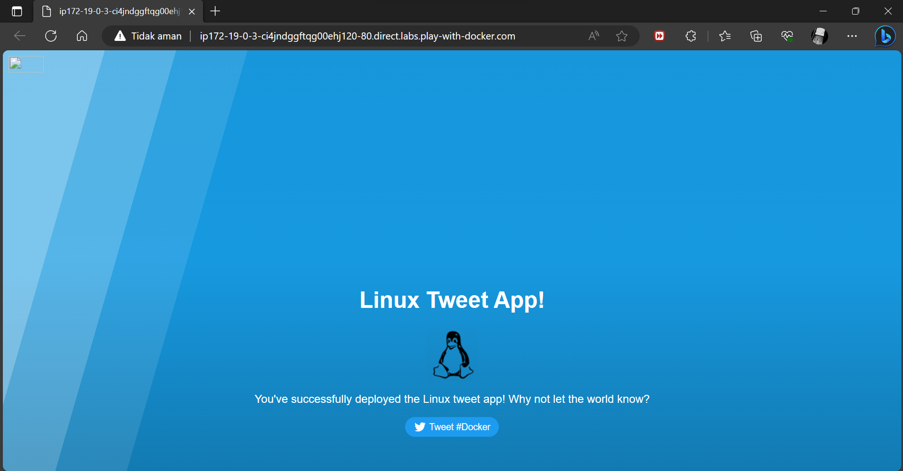 
    
8. Matikan dan hapus container
    
    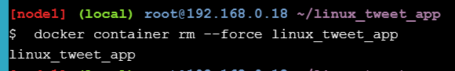 
    
## Task 3: Mengubah situs web yang sedang berjalan    
### Memulai aplikasi web dengan bind mount
1. Memulai aplikasi web dan pasang direktori. Pastikan berjalan pada direktori **linux_tweet_app**

    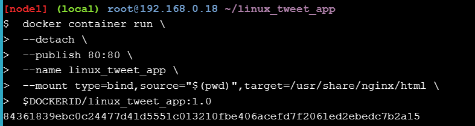 
    
2. Menjalankan [situs web](http://ip172-19-0-3-ci4jndggftqg00ehj120-80.direct.labs.play-with-docker.com/) dan ini harus berjalan
    
    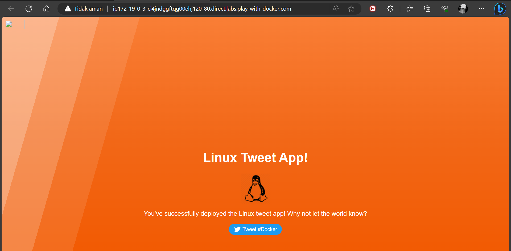 
    
### Ubah situs yang sedang berjalan
1. Salin ke dalam container index.html

    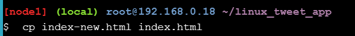 
    
2. Buka [situs](http://ip172-19-0-3-ci4jndggftqg00ehj120-80.direct.labs.play-with-docker.com/) dan segarkan halaman.

     
    
3. Hentikan dan hapus container
    
    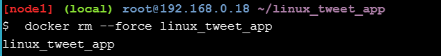 
    
4. Jalankan kembali dengan versi saat ini tanpa bind mount

    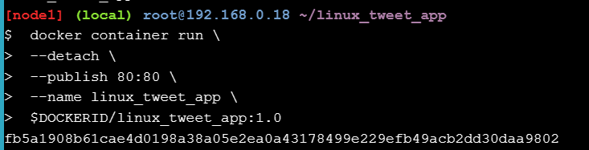
    
5. uka [situs](http://ip172-19-0-3-ci4jndggftqg00ehj120-80.direct.labs.play-with-docker.com/) dan segarkan halaman, tampilan akan kembali versi awal   

    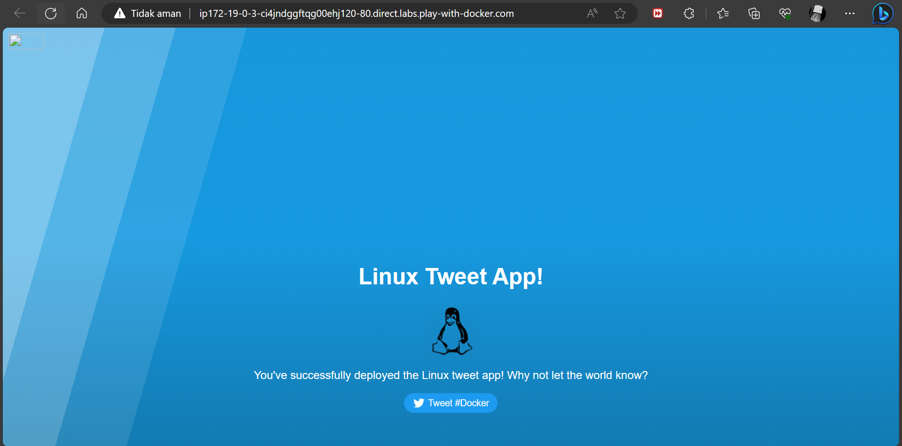 
    
6. Hentikan dan menghapus kontainer saat ini

        
    
### Perbarui Image    
