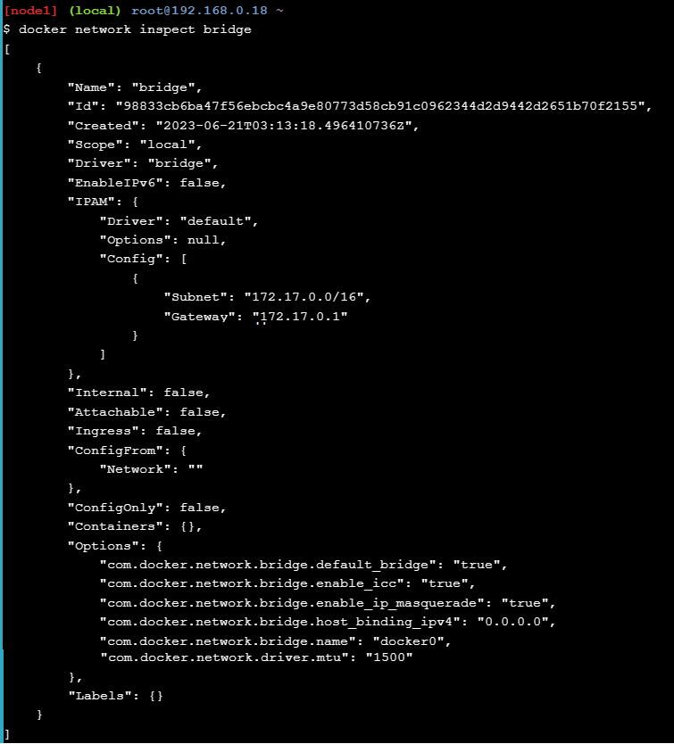

# Docker Networking Hands-on Lab

## Bagian 1 - Dasar Networking
### Step 1: Perintah Docker Network
Configurasi dengan perintah ```docker netwrok``` dan jalankan perintah tersebut
```
docker netwrok
```

### Step 2: Daftar Network
Jalankan perintah untuk melihat container yang terbentuk pada Docker Host dengan perintah
```
docker network ls
```

### Step 3: Memeriksa Network
Perintah untuk melihat detail dari nama, ID, IPAM dan conntainer yang terhubung menggunakan perintah 
```
docker network inspect bridge
```

### Step 4: Daftar Network Driver Plugins
Menampilkan banyak informasi tentang Docker installasi dengan perintah
```
docker info
```

## Bagian 2 - Penghubung Dengan Network
### Step 1: Dasar
1. Jalankan perintah ```docker network ls``` untuk memeriksa Docker bridge

   

   Hasil keluaran dari **bridge** terletak pada penyimpanan lokal
2. Install ```brctl``` command, hal ini dugunakan untuk mengatur, memelihara, memeriksa internet configurasi pada Linux kernel. untuk mendapatkan hal tersebut jalankan perintah
   ```
   apk update
   apk add bridge
   ```
   
3. Menmapilkan daftar bridge yang ada dalam Docker yang berjalan denga perintah ```brctl show```

   

4. Jalankan perintah ```ip a``` untuk melihar detail dari docker0 bridge

   
### Step 2: Menghubungkan dengan Container
1. Membuaat cintainer baru dengan bridge network
   Jalankan perintah ```docker run -dt ubuntu sleep infinity```

   
2. Jalankan perintah ```docker ps``` untuk melihat container yang berasal dari ubuntu:latelest image berjalan

   
3. Setelah container terhubung dan dirambahkan pada bridge network, jalankan perintah ```brctl show```

   

4. Memeriksa bridge network kembali dengan menjalankan perintah ```docker network inspect bridge```

   
### Step 3: Test Koneksi Nework
1. Lakukan perintah ```docker network inspect``` dengan ping koneksi dengan perintah ```ping -c5 <IPv4 Address>```

   
2. Menjalankan container dengan perintah ```docker ps```
   
   
3. Menjalankan ubuntu container dengan menjalankan ```docker exec -it <CONTAINER ID> /bin/bash```

   
4. Kemudian jalankan perintah untuk install ping program dengan perintah ```apt-get update && apt-get install -y iputils-ping```

   
5. Jalankan perintah ping ```ping -c5 www.github.com```

   
6. Lakukan pemutusan koneksi dengan containner dengan perintah exit
   
   
