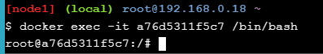
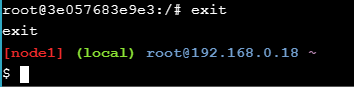

# Docker Networking Hands-on Lab

## Bagian 1 - Dasar Networking
### Step 1: Perintah Docker Network
Configurasi dengan perintah ```docker netwrok``` dan jalankan perintah tersebut
```
docker netwrok
```

### Step 2: Daftar Network
Jalankan perintah untuk melihat container yang terbentuk pada Docker Host dengan perintah
```
docker network ls
```

### Step 3: Memeriksa Network
Perintah untuk melihat detail dari nama, ID, IPAM dan conntainer yang terhubung menggunakan perintah 
```
docker network inspect bridge
```

### Step 4: Daftar Network Driver Plugins
Menampilkan banyak informasi tentang Docker installasi dengan perintah
```
docker info
```

## Bagian 2 - Penghubung Dengan Network
### Step 1: Dasar
1. Jalankan perintah ```docker network ls``` untuk memeriksa Docker bridge

   

   Hasil keluaran dari **bridge** terletak pada penyimpanan lokal
2. Install ```brctl``` command, hal ini dugunakan untuk mengatur, memelihara, memeriksa internet configurasi pada Linux kernel. untuk mendapatkan hal tersebut jalankan perintah
   ```
   apk update
   apk add bridge
   ```
   
3. Menmapilkan daftar bridge yang ada dalam Docker yang berjalan denga perintah ```brctl show```

   

4. Jalankan perintah ```ip a``` untuk melihar detail dari docker0 bridge

   
### Step 2: Menghubungkan dengan Container
1. Membuaat cintainer baru dengan bridge network
   Jalankan perintah ```docker run -dt ubuntu sleep infinity```

   
2. Jalankan perintah ```docker ps``` untuk melihat container yang berasal dari ubuntu:latelest image berjalan

   
3. Setelah container terhubung dan dirambahkan pada bridge network, jalankan perintah ```brctl show```

   

4. Memeriksa bridge network kembali dengan menjalankan perintah ```docker network inspect bridge```

   
### Step 3: Test Koneksi Nework
1. Lakukan perintah ```docker network inspect``` dengan ping koneksi dengan perintah ```ping -c5 <IPv4 Address>```

   
2. Menjalankan container dengan perintah ```docker ps```
   
   
3. Menjalankan ubuntu container dengan menjalankan ```docker exec -it <CONTAINER ID> /bin/bash```

   
4. Kemudian jalankan perintah untuk install ping program dengan perintah ```apt-get update && apt-get install -y iputils-ping```

   
5. Jalankan perintah ping ```ping -c5 www.github.com```

   
6. Lakukan pemutusan koneksi dengan containner dengan perintah exit
   
   
7. Atau dapat dilakukan juga pemutusan koneksi dengan containner dengan perintah
   ```
   docker stop <containerid>
   ```
      
### Step 4: Konfigurasi NAT Untuk Konektivitas Eksternal
1. Jalankan perintah untuk menjalankan pembuatan container baru berdasarkan image NGINX

   
2. Cek kembali status container dengan menjalankan perintah ```docker ps```

   

   Jika tidak dapa membuka sesi web, dapat menggunakan perintah ```curl 127.0.0.1:800```

   
## Bagian 3 - Jaringan Overlay   
### Step 1: Dasar
1. Membuat iniaslisasi Swarm baru dengan menggunakan perintah 
   ```
   docker swarm init --advertise-addr $(hostname -i)
   ```

   
2. Pada terminal kedua jalankan perintah
   ```
   docker swarm join \
   ```

   
3. Jalankan perintah ```docker node ls``` untuk memverifikasi bahwa node kedua telag menjadi bagian swarm

   
### Step 2: Buat Jaringan Overlay
1. Buat netwrork Overlay bernama overnet dengan menjalankan perintah
   ```
   docker network create -d overlay overnet
   ```

   
2. Jalankan perintah ```docker network ls``` untuk mengetahui bahwa jaringan sudah dibuat

   
   **Jika perintah ini dijalankan pada terminal 2 maka jaringan overnet tidak akan tertampil**
3. Jalankan perintah ```docker network inspect overnet``` untuk melihat rincian jaringan overnet

   
### Step 3: Buat Layanan
1. Buat layanan bernama myservice pada jaringan overnet dengan perintah
   ```
   docker service create --name myservice \
   --network overnet \
   --replicas 2 \
   ubuntu sleep infinity
   ```

   
2. Verifikasi dengan menjalankan perintah ```docker service ls```

   

3. Verifikasi bahwa satu tugas (replika) berjalan pada masing-masing dari dua node di Swarm dengan menjalankan .docker service ps myservice

   

4. Melihat jaringan "overnet". Mari kita jalankan dari terminal kedua untuk memverifikasi
   ```
   docker network ls
   ```

   
5. Mendapatkan informasi lebih rinci tentang jaringan "overnet" dan mendapatkan alamat IP dari tugas yang berjalan di terminal kedua ```docker network inspect overnet```

    
### Step 4: Uji Jaringan
1. Jalankan perintah pada terminal 1

    
2. Jalankan perintah untuk mendapatkan ID tugas layanan sehingga Anda dapat masuk ke dalamnya di langkah berikutnya ```docker ps```

   
3. Jalankan perintah ```docker exec -it <CONTAINER ID> /bin/bash```

   
4. Jalankan perintah ```apt-get update && apt-get install -y iputils-ping```

   
5. Ping pada 10.0.1.3

   
   Hal tersebut menunjukkan bahwa kedua tugas dari layanan myservice berada di jaringan overlay yang sama yang mencakup kedua node dan mereka dapat menggunakan jaringan ini untuk berkomunikasi.
### Step 5: Uji Penemuan Layanan
1. Jalankan perintah pada container ```cat /etc/resolv.conf```

   
 2. Coba dan ping nama "myservice" dari dalam kontainer dengan menjalankan .ping -c5 myservice

   
 3. Ketik perintah untuk meninggalkan sesi kontainer dan kembali ke perintah shell host Docker ```exit``` 

   
4. Verifikasi bahwa nilai VIP cocok dengan nilai yang dikembalikan oleh perintah sebelumnya ```docker service inspect myserviceping -c5 myservice```

   

## Cleaning
1. Jalankan perintah untuk menghapus layanan yang disebut myservice ```docker service rm myservice```

   
2. Jalankan perintah untuk mendapatkan daftar kontainer yang sedang berjalan ```docker ps```

   
3. Mematikan perintah ubuntu dan nginx dengan perintah ```docker kill```

   
4. Menghapus node1 dan node 2 dari swarm dengan perintah ```docker swarm leave --force```

   
   
