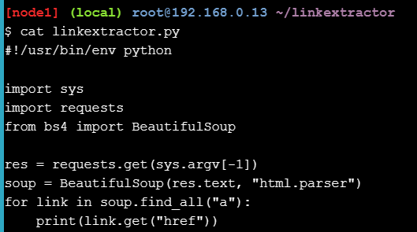
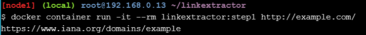
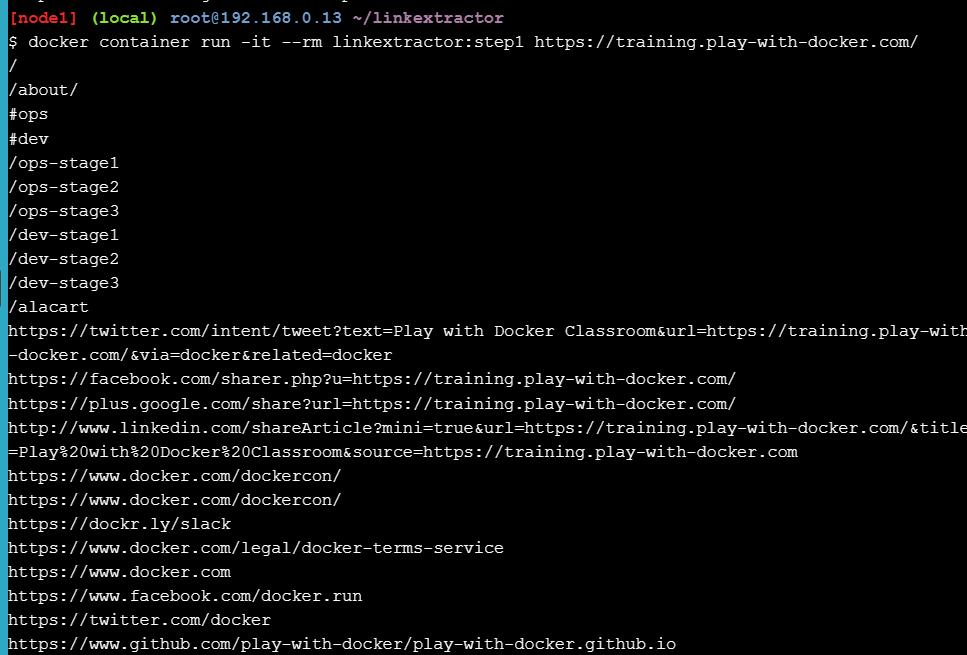
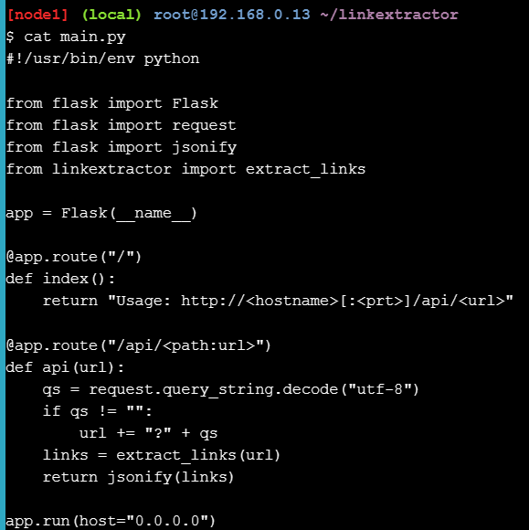
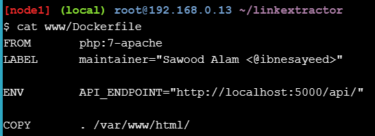
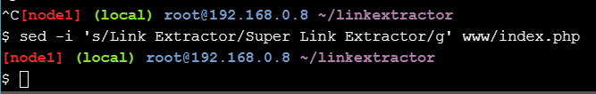

# Application Containerization and Microservice Orchestration

## Setup
Mulai dengan cloning repository demo

## Step 0: Basic Link Extractor Script
1. Melihat list pada cabang step0

   
   
2. Terdapat file linkextractor.py, untuk melihat isi file gunakan perintah
  
   

3. Menjalankan file

   
  
4. Ketika mencoba menjalankannya sebagai skrip, kami mendapat kesalahan. Mari kita periksa izin saat ini pada file

   
   
5. Menjalankannya sebagai program Python

   

## Step 1: Containerized Link Extractor Script
1. Periksa daftar pada step1

   

2. Melihat isi dockerfile
  
   
   
3. Membuat image pada step1

   

4. Setelah build image berhasil lakukan untuk melihat isi image

   

5. Menjalankan container dengan image dan web extract link
  
   

6. Mencoba web page dengan banyak link

   

## Step 2: Link Extractor Module with Full URI and Anchor Text
1. Periksa daftar pada step2

   

2. Melihat isi file linkextractor.py terbaru
  
   
   
3. Membuat image baru pada step2

   

4. Setelah build image berhasil lakukan untuk melihat isi image

   

5. Menjalankan container dengan image dan web extract link
  
   

6. Menjalankan container dengan image sebelumnya

   

## Step 3: Link Extractor API Service
1. Periksa daftar pada step3

   

2. Melihat isi file dockerfile terbaru
  
   
   
3. Menambah file baru bernama main.py

   

4. Membuat image baru

   

5. Menjalankan container dengan port 5000

   
   
6. Setelah build image berhasil lakukan untuk melihat isi image

   

7. Memembuat permintaan HTTP dalam bentuk untuk berbicara dengan server ini dan mengambil respons yang berisi tautan yang diekstraksi
  
   

8. Melihat catatan yang terjadi pada container menggunakan log

   

9. Menonaktifkan dan menghapus container

   

## Step 4: Link Extractor API and Web Front End Services
1. Periksa daftar pada step4

   

2. Melihat isi file docker-compose.yml
  
   
   
3. Melihat script yang ada pada tampilan pengguna

   

4. Membawa layanan dalam mode terpisah menggunakan utilitas docker-compose

   

5. Memeriksa daftar kontainer yang berjalan menegaskan bahwa kedua layanan tersebut memang berjalan

   
   
6. meminta izin pada API Service untuk akses pada interface web [link Extractor](http://ip172-18-0-78-cig2de4snmng00fa3omg-80.direct.labs.play-with-docker.com/?url=https%3A%2F%2Fgithub.com%2Fmayaalf%3Ftab%3Drepositories)

   

7. Modifikasi www/index.php dengan mengganti semua kejadian dari Link Extractor dengan Super Link Extractor
  
   

   Klik link ini [click here](http://ip172-18-0-78-cig2de4snmng00fa3omg-80.direct.labs.play-with-docker.com/?url=https%3A%2F%2Fgithub.com%2Fmayaalf%3Ftab%3Drepositories)
   
   

8. Mengembalikan perubahan ini sekarang untuk membersihkan pelacakan Git

   

9. Sebelum pindah pada step berikutnya, lakukan shut service down untuk membantu menjaga Docker Compose

    

## Step 5: Redis Service for Caching
1. Periksa daftar pada step5

   

2. Melihat penambahan baru pada dockerfile 
  
   
   
3. Selanjutnya, melihat file server API tempat kita menggunakan cache Redis:

   

4. Melihat perubahan pada docker-compose.yml

   

5. Melakukan boot layanan dengan perintah ini
  
   

6. Clik akses interface dengan [Link Extractor](http://ip172-18-0-78-cig2de4snmng00fa3omg-80.direct.labs.play-with-docker.com/?url=https%3A%2F%2Fgithub.com%2Fmayaalf%3Ftab%3Drepositories)

   

7. Gunakan docker-compose exec untuk monitor Redis CLI Command

   

   Menjalankan link extractor
   
   

8. Verifikasi perubahan yang dibuat dalam lokal tidak mencerminkan dalam layananan yang sedang berjalan

   

9. Mencerminkan layanan yang berjalan

   

10. Shut down service

     

## Step 6: Swap Python API Service with Ruby
1. Periksa daftar pada step6

      

2. Melihat penambahan baru
   
   
   
3. melihat api pada dockefile

     

4. Selanjutnya, melihat file server API Ruby pada Docker-compose.yml

   

6. Membuat build baru layanan

   

7. Melakukan akses APIdengan port terbaru
  
   
   
8. Clik akses interface dengan [Link Extractor](http://ip172-18-0-78-cig2de4snmng00fa3omg-80.direct.labs.play-with-docker.com/?url=https%3A%2F%2Fgithub.com%2Fmayaalf%3Ftab%3Drepositories)

   

9. Gunakan tail dengan perintah -f untuk melihat output
    
   

   Menjalankan link extractor
   
   

10. Verifikasi perubahan yang dibuat dalam lokal tidak mencerminkan dalam layananan yang sedang berjalan

   

11. Karena telah mempertahankan log, log tersebut harus tetap tersedia setelah layanan hilang

   
