# Docker Orchestration Hands-on Lab

## Bagian 1 : Configure Swam Mode

Membuat container baru pada node 1 dengan menjalankan perintah
```
docker run -dt ubuntu sleep infinity
```
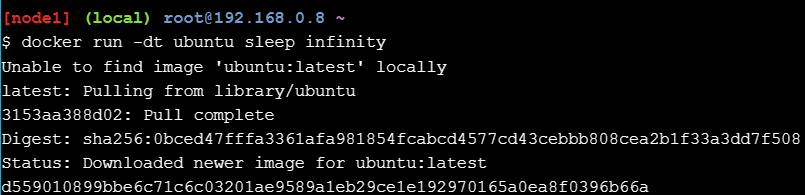

Melihat container yang berjalan pada node1

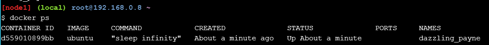

### Step 2.1 Create Manager Node
Inisialisasi Swarm baru, di gabungkan dengan single worker node, jalankan perintah pada node 1
```
docker swarm init --advertise-addr $(hostname -i)
```

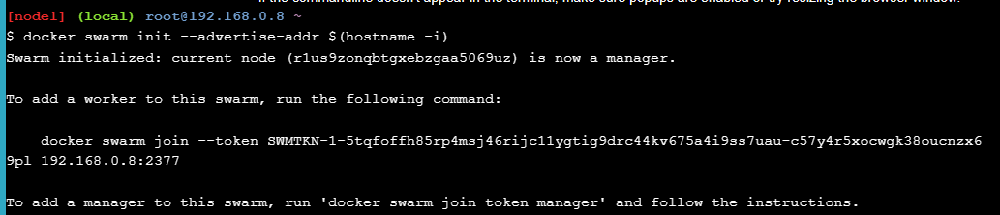

Jalankan ```docker info``` untuk verifikasi bahwa node 1 sudah sukses terfkonfigurasi dengan swam manager node

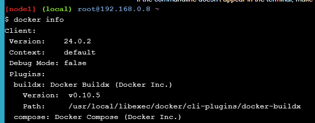

### Step 2.2 Join Wokrer Nodes To The Swarm

Copy command terakhir yang tertampil pada verivikasi pada docker info pada node 1 ke node 2 dan node 3

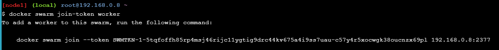

Node 2

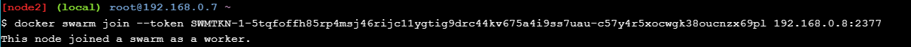

Node 3

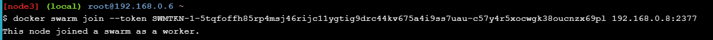

Lihat status node pada node 1, apakah node 2 dan 3 sudah berhasil join.

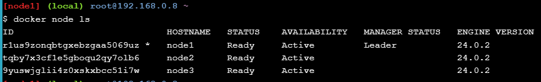

## Bagian 2 : Deploy Applications Across Multiple Hosts 
### Step 2.1 Deploy the application components as Docker services

Jalankan pada node 1 perintah sebagai berikut
```
docker service create --name sleep-app ubuntu sleep infinity
```

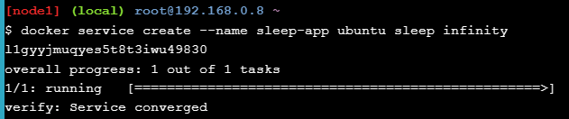

Jalankan perintah untuk verifikasi service create sudah diterima oleh Swarm Manager

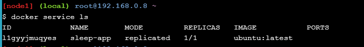

##Bagian 3 : Scale the Application

Pada node 1 jalankan perintah ``` docker service update --replicas 7 sleep-app``` untuk scale nomor container di sleep-app menjadi no 7

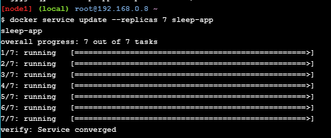

Jalankan perintah untuk melihat container secara real time


```Terlihat sekarang container pada node 1 berada di urutan no 7```

Ubah service untuk menghapus container 4 sleep-app

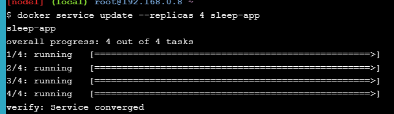

Jalankan perintah untuk menampilkan service sleep-app

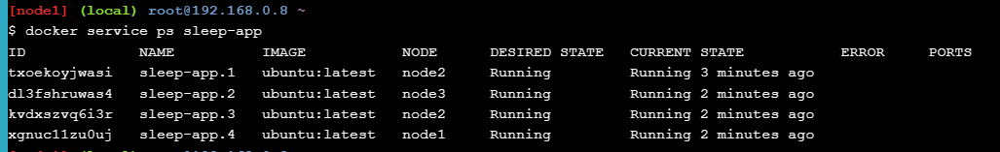

## Bagian 4 Drain a node and reschedule the containers
Jalankan perintah untuk melihat status node pada node1

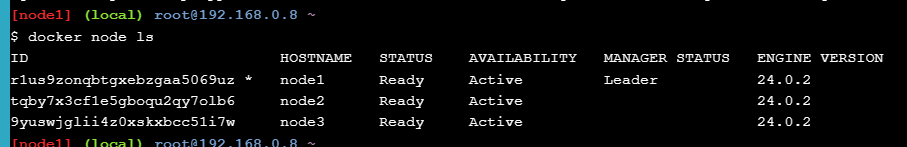

Jalankan pada node 2 untuk melihat container yang berjalan

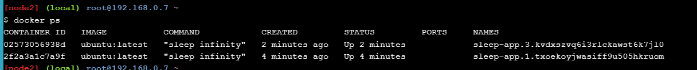

Balik ke node1 untuk menghapus service pada node 2 


Gunakan ID node 2 dan jalankan perintah pada node 1

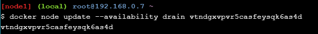

Cek status

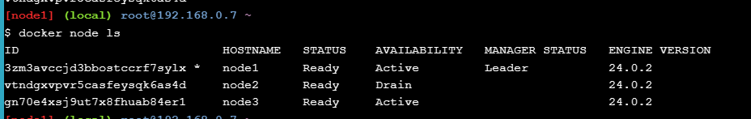

Balik pada node 2 dan lihat apa yang terjadi

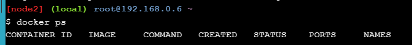
Container yang berjalan tidak ada pada node 2

Pastikan lagi di node 1 dengan perintah

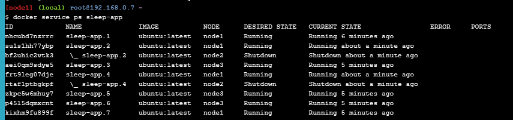

## Cleaning UP

Jalankan docker service rm sleep-app pada node 1 untuk menghapus service

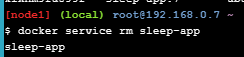

Jalankan perintah untuk lihat container yang berjalan


Remove semua node 1,2,3 dari swarm dengan perintah

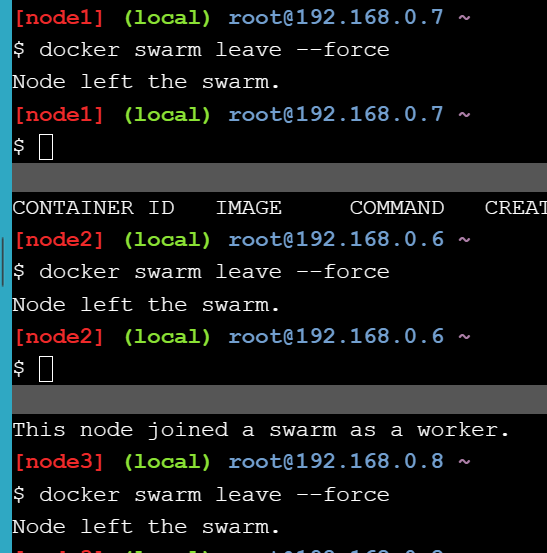
